# LinguaQuest RPG — 架构设计文档

**文档编号**：LQ-ARCH-001
**版本**：1.0
**日期**：2026年4月
**关联文档**：LQ-SRS-001（软件需求规格说明书 v1.0）
**状态**：草案

---

## 目录

1. [系统架构概述](#1-系统架构概述)
2. [技术栈选型](#2-技术栈选型)
3. [模块分解](#3-模块分解)
4. [数据架构](#4-数据架构)
5. [API 架构](#5-api-架构)
6. [安全架构](#6-安全架构)
7. [基础设施架构](#7-基础设施架构)
8. [MVP 范围定义](#8-mvp-范围定义)
9. [技术风险评估](#9-技术风险评估)
10. [开发阶段规划](#10-开发阶段规划)

---

## 1. 系统架构概述

### 1.1 架构风格

LinguaQuest RPG 采用 **云端-客户端混合架构**，结合以下架构模式：

- **客户端（CocosCreator）**：单体游戏应用，包含渲染引擎、音频管线、本地推理
- **云端后端**：微服务架构，按业务能力边界拆分服务
- **事件驱动**：精灵教练 Agent 通过消息总线异步解耦
- **智能路由**：LLM 任务按复杂度自动路由至云端或本地

### 1.2 高层架构图

```mermaid
graph TB
    subgraph 客户端设备 ["客户端设备 (iOS / Android / Web)"]
        subgraph CocosClient ["CocosCreator 客户端"]
            GameEngine["游戏引擎<br/>CocosCreator 3.8+"]
            AudioPipeline["音频管线<br/>VAD + 音频采集"]
            WakeWord["唤醒词检测<br/>TensorFlow Lite <5MB"]
            LocalLLM["本地 LLM 推理<br/>llama.cpp (quantized 1-3B)"]
            UI["UI 层<br/>纯语音交互, 无键盘"]
        end
    end

    subgraph 云端 ["云端 (AWS / GCP)"]
        APIGW["API 网关<br/>Kong / AWS API Gateway"]
        AuthService["认证服务<br/>Firebase Auth / Supabase Auth"]

        subgraph 核心服务 ["核心微服务"]
            VoiceService["语音服务<br/>Whisper ASR + ElevenLabs TTS"]
            DialogueService["对话服务<br/>LLM 路由 + NPC 引擎"]
            SpiritCoach["精灵教练 Agent<br/>异步错误分析"]
            QuestService["任务服务<br/>任务引擎 + 进度追踪"]
            AssessmentService["评估服务<br/>5维评估 + CEFR 映射"]
            RewardService["奖励服务<br/>物品掉落 + 展示厅"]
        end

        subgraph 辅助服务 ["辅助服务"]
            ContentFilter["内容安全<br/>Moderation API + 规则引擎"]
            CMS["CMS 内容管理<br/>NPC 对话库 + 任务脚本"]
            ParentDashboard["家长控制台<br/>学习报告 + 时间管理"]
            SubscriptionService["订阅服务<br/>Stripe + 内购验证"]
            AnalyticsService["分析服务<br/>使用指标 + 成本监控"]
        end

        subgraph 数据层 ["数据层"]
            PrimaryDB["主数据库<br/>Supabase (PostgreSQL)"]
            RedisCache["缓存层<br/>Redis (会话 + 热数据)"]
            BlobStorage["对象存储<br/>S3 / Supabase Storage<br/>(TTS 音频 + 游戏资源)"]
            MessageBus["消息总线<br/>Redis Streams / NATS"]
        end
    end

    subgraph 外部服务 ["外部服务"]
        OpenAI_API["OpenAI API<br/>GPT-4o + Whisper + Moderation"]
        Anthropic_API["Anthropic API<br/>Claude (备用 LLM)"]
        ElevenLabs["ElevenLabs TTS<br/>多音色语音合成"]
        Stripe["Stripe 支付<br/>订阅管理"]
    end

    CocosClient <-->|HTTPS + WebSocket| APIGW
    APIGW --> AuthService
    APIGW --> 核心服务
    APIGW --> 辅助服务

    核心服务 <--> MessageBus
    核心服务 <--> PrimaryDB
    核心服务 <--> RedisCache

    VoiceService --> OpenAI_API
    DialogueService --> OpenAI_API
    DialogueService --> Anthropic_API
    VoiceService --> ElevenLabs
    DialogueService --> ContentFilter
    ContentFilter --> ElevenLabs
    SubscriptionService --> Stripe

    WakeWord -.本地触发.> SpiritCoach
    AudioPipeline -->|音频流| VoiceService
    LocalLLM -.离线降级.> GameEngine
```

### 1.3 核心设计决策

| 决策 | 选择 | 理由 |
|------|------|------|
| 客户端架构 | CocosCreator 单体 | 统一代码库覆盖 iOS/Android/Web，游戏生态成熟 |
| 云端架构 | 微服务（Node.js/Python） | 按业务能力拆分，独立部署扩展，LLM 密集服务可单独扩缩 |
| 数据库 | Supabase (PostgreSQL) | 内置 Auth + Row Level Security + 实时订阅，GDPR 数据驻留可控 |
| 精灵教练通信 | 异步消息总线（Redis Streams） | 解耦主对话流，不阻塞 NPC 回复管线 |
| 本地 LLM | llama.cpp (quantized 1-3B) | 移动端兼容性好，Metal/OpenGL GPU 加速，无需额外依赖 |
| 内容安全 | OpenAI Moderation API + 自定义规则引擎 | 双层防护，满足 COPPA 99.9% 有效率要求 |

---

## 2. 技术栈选型

### 2.1 客户端技术栈（CocosCreator）

| 层级 | 技术选型 | 版本 | 用途 |
|------|---------|------|------|
| 游戏引擎 | CocosCreator | 3.8+ | 跨平台游戏渲染（iOS/Android/Web） |
| 开发语言 | TypeScript | 5.0+ | CocosCreator 原生脚本语言 |
| 音频采集 | Web Audio API (Web) / AVAudioSession (iOS) / AudioRecord (Android) | 原生 | 麦克风音频采集与 VAD 前端处理 |
| VAD 引擎 | Silero VAD (ONNX Runtime) | 最新 | 语音端点检测，轻量级，支持儿童声学 |
| 唤醒词模型 | TensorFlow Lite 自定义 KWS 模型 | <5MB | 中/英/日三语唤醒词本地检测 |
| 本地 LLM | llama.cpp | 最新稳定版 | 量化 1-3B 模型本地推理（词汇解释、发音示范） |
| 网络通信 | WebSocket + REST | — | 与云端实时通信 |
| 音频编解码 | Opus | — | 低延迟音频压缩传输（8-16kbps） |

### 2.2 云端后端技术栈

| 服务 | 技术选型 | 版本 | 用途 |
|------|---------|------|------|
| API 网关 | Kong | 3.x | 请求路由、限流、认证、CORS |
| 核心服务运行时 | Node.js (TypeScript) + Fastify | 20 LTS + 4.x | 低延迟 I/O 密集型服务（对话、任务、奖励） |
| AI/评估服务运行时 | Python + FastAPI | 3.12 + 0.110+ | CPU/GPU 密集型服务（ASR、TTS、评估、内容安全） |
| 认证 | Supabase Auth (GoTrue) | — | JWT 认证、邮箱验证、OAuth、COPA 家长验证 |
| 数据库 | Supabase (PostgreSQL) | 16 | 关系型数据存储，RLS 保障儿童数据隔离 |
| 缓存 | Redis (Upstash / AWS ElastiCache) | 7.x | 会话状态、热数据缓存、消息队列 |
| 消息总线 | Redis Streams | 7.x | 精灵教练异步消息传递、事件驱动 |
| 对象存储 | Supabase Storage (S3 兼容) | — | TTS 音频文件、游戏资源、头像图片 |
| 内容安全 | OpenAI Moderation API + AJV 规则引擎 | — | AI 生成内容双层过滤 |
| CMS | Strapi Headless CMS | 4.x | NPC 对话库、任务脚本、多语言内容管理 |
| 监控 | Sentry + Prometheus + Grafana | — | 错误追踪、性能指标、告警 |
| 日志 | Pino (Node.js) + Loguru (Python) → Datadog | — | 结构化日志，ELK 风格查询 |

### 2.3 外部服务集成

| 服务 | 供应商 | 用途 | 备用方案 |
|------|--------|------|---------|
| LLM 云端 API | OpenAI (GPT-4o) 主 / Anthropic (Claude 3.5 Sonnet) 备 | NPC 对话生成、精灵教练分析 | 多供应商热切换 |
| ASR | OpenAI Whisper API (whisper-1) | 语音转文字 | Azure Speech (Phase 2) |
| TTS | ElevenLabs (Turbo v2.5) | 多音色语音合成 | Azure Speech TTS (Phase 2) |
| 支付 | Stripe (Web) + Apple IAP / Google Play Billing (Mobile) | 订阅管理、内购验证 | RevenueCat (Phase 2) |
| 语法检测 | LanguageTool API | 语法错误识别 | 自研规则引擎 (Phase 3) |

### 2.4 选型理由总结

**Supabase vs Firebase**：选择 Supabase 作为主数据存储，原因：
- PostgreSQL 原生支持 RLS（Row Level Security），天然满足儿童数据逻辑隔离
- 数据驻留可控（可指定 AWS/GCP 区域），满足 GDPR 数据驻留要求
- 内置 Auth 与数据库深度集成，减少认证开发量
- REST + Realtime WebSocket API 开箱即用

**Node.js + Fastify 为核心服务运行时**：
- TypeScript 全栈统一，减少上下文切换
- Fastify 高性能（比 Express 快 2-3 倍），适合语音管线低延迟要求
- 生态丰富，LLM SDK 支持完善

**Python + FastAPI 为 AI 服务运行时**：
- AI/ML 生态原生支持
- 异步 I/O 与 Node.js 服务性能相当
- 方便后续集成自研评估模型

---

## 3. 模块分解

### 3.1 客户端模块（CocosCreator 内部）

```mermaid
graph LR
    subgraph CocosCreator_Client ["CocosCreator 客户端模块"]
        AudioMgr["音频管理器<br/>AudioManager.ts"]
        VAD["语音端点检测<br/>VADDetector.ts"]
        WakeWord["唤醒词检测<br/>WakeWordDetector.ts"]
        VoicePipeline["语音管线编排<br/>VoicePipeline.ts"]
        LocalLLMRouter["本地 LLM 路由器<br/>LocalLLMRouter.ts"]
        SpiritCoachUI["精灵教练 UI<br/>SpiritCoachUI.ts"]
        GameWorld["游戏世界管理<br/>GameWorld.ts"]
        QuestUI["任务 UI<br/>QuestUI.ts"]
        RewardUI["奖励展示厅<br/>RewardShowcaseUI.ts"]
        OfflineCache["离线缓存<br/>OfflineCache.ts"]
        SyncMgr["数据同步<br/>SyncManager.ts"]
        ChildMode["儿童模式<br/>ChildModeGuard.ts"]
    end
```

| 模块 | 职责 | 关键接口 | 依赖 |
|------|------|---------|------|
| **AudioManager** | 麦克风采集、扬声器输出、音频格式转换（PCM → Opus） | `startCapture()`, `stopCapture()`, `playAudio(url)` | 原生音频 API |
| **VADDetector** | 实时检测语音起止，输出静音/说话状态 | `onSpeechStart`, `onSpeechEnd`, `onSilence` | AudioManager |
| **WakeWordDetector** | TensorFlow Lite 本地运行 KWS 模型，触发唤醒事件 | `onWakeWord(lang)`, `setThreshold()` | TFLite Runtime |
| **VoicePipeline** | 编排完整管线：VAD → ASR → LLM 路由 → TTS → 播放 | `processTurn(audioStream)`, `abort()` | 所有上述模块 + 云端 API |
| **LocalLLMRouter** | 判断任务类型，路由至本地 LLM 或云端 | `route(taskType, input)`, `setOfflineMode(bool)` | llama.cpp binding |
| **SpiritCoachUI** | 精灵动画、光晕颜色、飞行轨迹、非侵入提示 | `showHint(text, color)`, `playAnimation(type)` | SpiritCoach 云端服务 |
| **GameWorld** | 场景加载、NPC 位置管理、环境音效 | `loadScene(sceneId)`, `loadNPCs(sceneId)` | QuestUI, 云端 |
| **QuestUI** | 任务面板、进度追踪、LXP 雷达图 | `showQuest(questId)`, `showAssessment(scores)` | AssessmentService |
| **RewardShowcaseUI** | 奖励展示厅、装备系统、装饰放置 | `showShowcase()`, `equip(itemId)`, `placeDecoration()` | RewardService |
| **OfflineCache** | 本地 SQLite 存储离线数据（对话日志、任务进度） | `save(data)`, `getPendingSync()`, `clear()` | SQLite (Cocos 插件) |
| **SyncManager** | 网络恢复后批量同步离线数据至云端 | `syncPending()`, `onConnect()`, `onDisconnect()` | OfflineCache, 云端 API |
| **ChildModeGuard** | 儿童模式客户端校验（时间限制、功能屏蔽、语音退出） | `checkTimeLimit()`, `handleVoiceExit()`, `blockSocial()` | 本地计时器 |

### 3.2 云端微服务分解

```mermaid
graph TB
    subgraph 服务边界
        subgraph S1 ["语音服务 (Python/FastAPI)"]
            ASR["ASR 处理器"]
            TTS["TTS 合成器"]
            PronunciationScorer["发音评分器"]
        end

        subgraph S2 ["对话服务 (Node.js/Fastify)"]
            LLMMiddleware["LLM 路由中间件"]
            NPCEngine["NPC 对话引擎"]
            PromptManager["提示词管理器"]
        end

        subgraph S3 ["精灵教练 (Node.js/Fastify)"]
            ErrorDetector["错误检测器"]
            InterventionMgr["干预管理器"]
            ErrorProfileGen["错误图谱生成"]
            BilingualMgr["双语比例管理"]
        end

        subgraph S4 ["任务服务 (Node.js/Fastify)"]
            QuestEngine["任务引擎"]
            ProgressTracker["进度追踪"]
            DailyQuestGen["日常任务生成器"]
        end

        subgraph S5 ["评估服务 (Python/FastAPI)"]
            MicroAssess["微评估"]
            PeriodicAssess["阶段评估"]
            CEFRMapper["CEFR 映射器"]
            ReportGen["报告生成"]
        end

        subgraph S6 ["奖励服务 (Node.js/Fastify)"]
            DropEngine["掉落引擎"]
            ShowcaseMgr["展示厅管理"]
            MilestoneTracker["里程碑追踪"]
        end
    end

    RedisBus[(Redis Streams<br/>消息总线)]
    S2 -.异步推送.> RedisBus
    RedisBus -.消费.> S3
```

| 服务 | 语言 | 端口 | 副本数(MVP) | CPU | 内存 | 核心职责 |
|------|------|------|------------|-----|------|---------|
| **语音服务** | Python/FastAPI | 8001 | 2 | 2 vCPU | 4GB | Whisper ASR 调用、ElevenLabs TTS 合成、发音评分 |
| **对话服务** | Node.js/Fastify | 8002 | 3 | 1 vCPU | 1GB | LLM 智能路由、NPC 对话生成、提示词管理 |
| **精灵教练** | Node.js/Fastify | 8003 | 2 | 1 vCPU | 1GB | 异步错误检测、干预时机判断、错误图谱、双语比例 |
| **任务服务** | Node.js/Fastify | 8004 | 1 | 0.5 vCPU | 512MB | 任务状态管理、进度追踪、日常任务每日重置 |
| **评估服务** | Python/FastAPI | 8005 | 1 | 1 vCPU | 2GB | 微评估计算、CEFR 映射、雷达图数据生成 |
| **奖励服务** | Node.js/Fastify | 8006 | 1 | 0.5 vCPU | 512MB | 掉落概率计算、展示厅管理、里程碑追踪 |

### 3.3 辅助服务

| 服务 | 语言 | 端口 | 职责 |
|------|------|------|------|
| **认证服务** | Supabase Auth (内置) | — | JWT 发放/验证、邮箱验证、家长子账户绑定 |
| **内容安全服务** | Python/FastAPI | 8007 | OpenAI Moderation API 调用 + 自定义规则引擎、安全阈值计数、NPC 自动下线 |
| **CMS 服务** | Strapi (Node.js) | 8008 | NPC 对话库 CRUD、任务脚本管理、多语言内容版本控制、热更新推送 |
| **家长控制台** | Next.js (SSR) | 8009 | 学习报告可视化、时间管理设置、数据删除请求 |
| **订阅服务** | Node.js/Fastify | 8010 | Stripe 订阅生命周期、Apple IAP / Google Play 收据验证、免费层功能门控 |
| **分析服务** | Node.js/Fastify | 8011 | 使用指标收集、API 成本监控、告警触发（AI API 费用 > 150% 基准） |

### 3.4 模块间通信模式

| 通信场景 | 模式 | 协议 | 超时 |
|---------|------|------|------|
| 客户端 → 语音服务 | 同步 HTTP | REST + Opus 音频流 | 3s |
| 客户端 → 对话服务 | 同步 HTTP | REST JSON | 5s |
| 对话服务 → 精灵教练 | 异步消息 | Redis Streams | 无超时（最终一致性） |
| 精灵教练 → 评估服务 | 同步 HTTP | REST JSON | 2s |
| 评估服务 → 数据库 | 同步 HTTP | Supabase REST API | 1s |
| 客户端 ← 云端推送 | 实时 WebSocket | Supabase Realtime | 长连接 |
| 对话服务 → LLM 云端 | 同步 HTTP | OpenAI SDK (streaming) | 10s |
| 对话服务 → 本地 LLM | 同步 HTTP/gRPC | llama.cpp server | 5s |

---

## 4. 数据架构

### 4.1 数据库选型与分区策略

**主数据库：Supabase (PostgreSQL 16)**

- 使用 PostgreSQL Schema 实现数据逻辑隔离
- 标准用户与儿童用户数据分别存储于 `public` 和 `child_data` Schema
- Row Level Security (RLS) 强制执行跨 Schema 访问控制

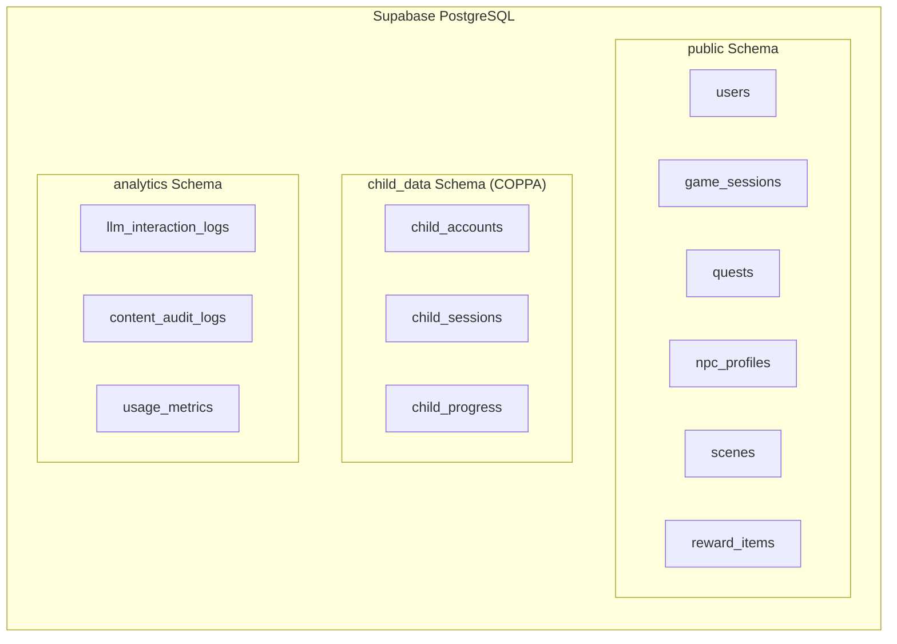

### 4.2 核心表设计（精简版，对应 SRS 第 11 章）

#### users 表
```sql
CREATE TABLE users (
    user_id UUID PRIMARY KEY DEFAULT gen_random_uuid(),
    email TEXT UNIQUE NOT NULL,
    display_name TEXT NOT NULL,
    account_type TEXT NOT NULL CHECK (account_type IN ('standard', 'child', 'parent', 'institution')),
    age_group TEXT NOT NULL CHECK (age_group IN ('child', 'teen', 'adult')),
    created_at TIMESTAMPTZ DEFAULT NOW(),
    last_login TIMESTAMPTZ,
    subscription_status TEXT DEFAULT 'free' CHECK (subscription_status IN ('free', 'premium_monthly', 'premium_annual', 'b2b')),
    preferred_language TEXT NOT NULL,  -- ISO 639-1
    target_language TEXT NOT NULL,      -- ISO 639-1
    cefr_level TEXT DEFAULT 'A1' CHECK (cefr_level IN ('A1', 'A2', 'B1', 'B2', 'C1', 'C2')),
    created_at TIMESTAMPTZ DEFAULT NOW(),
    updated_at TIMESTAMPTZ DEFAULT NOW()
);
```

#### child_accounts 表 (child_data Schema)
```sql
CREATE TABLE child_data.child_accounts (
    child_id UUID PRIMARY KEY REFERENCES users(user_id),
    parent_id UUID NOT NULL REFERENCES users(user_id),
    display_name TEXT NOT NULL,
    age INTEGER CHECK (age BETWEEN 6 AND 13),
    avatar_id TEXT,
    daily_time_limit_minutes INTEGER DEFAULT 60 CHECK (daily_time_limit_minutes BETWEEN 15 AND 120),
    total_time_today INTEGER DEFAULT 0,
    time_reset_date DATE DEFAULT CURRENT_DATE
);

-- RLS: 家长只能访问自己的子账户
ALTER TABLE child_data.child_accounts ENABLE ROW LEVEL SECURITY;
CREATE POLICY parent_access ON child_data.child_accounts
    FOR ALL USING (parent_id = auth.uid());
```

#### game_sessions 表
```sql
CREATE TABLE game_sessions (
    session_id UUID PRIMARY KEY DEFAULT gen_random_uuid(),
    user_id UUID NOT NULL REFERENCES users(user_id),
    start_time TIMESTAMPTZ DEFAULT NOW(),
    end_time TIMESTAMPTZ,
    chapter_id TEXT,
    scene_id UUID REFERENCES scenes(scene_id),
    lxp_earned INTEGER DEFAULT 0,
    cefr_snapshot TEXT
);

-- 索引
CREATE INDEX idx_sessions_user ON game_sessions(user_id);
CREATE INDEX idx_sessions_active ON game_sessions(user_id) WHERE end_time IS NULL;
```

#### dialogue_turns 表
```sql
CREATE TABLE dialogue_turns (
    turn_id UUID PRIMARY KEY DEFAULT gen_random_uuid(),
    session_id UUID NOT NULL REFERENCES game_sessions(session_id),
    turn_number INTEGER NOT NULL,
    speaker_type TEXT NOT NULL CHECK (speaker_type IN ('player', 'npc', 'spirit_coach')),
    speaker_id TEXT NOT NULL,
    asr_text TEXT,
    confidence_score FLOAT CHECK (confidence_score BETWEEN 0 AND 1),
    npc_response_text TEXT,
    tts_audio_ref TEXT,  -- Supabase Storage 路径
    timestamp TIMESTAMPTZ DEFAULT NOW(),
    language_detected TEXT  -- ISO 639-1
);

-- 索引
CREATE INDEX idx_turns_session ON dialogue_turns(session_id, turn_number);
```

#### npc_memories 表（向量检索增强）
```sql
CREATE TABLE npc_memories (
    memory_id UUID PRIMARY KEY DEFAULT gen_random_uuid(),
    npc_id UUID NOT NULL REFERENCES npc_profiles(npc_id),
    user_id UUID NOT NULL REFERENCES users(user_id),
    remembered_keywords JSONB,
    interaction_count INTEGER DEFAULT 0,
    affinity_score INTEGER DEFAULT 0 CHECK (affinity_score BETWEEN 0 AND 100),
    last_interaction_at TIMESTAMPTZ,
    -- 向量嵌入（Phase 2 启用，用于语义记忆检索）
    memory_embedding vector(384)  -- pgvector 扩展
);

-- Phase 2: 启用 pgvector 后创建索引
-- CREATE INDEX idx_memories_embedding ON npc_memories
--     USING ivfflat (memory_embedding vector_cosine_ops) WITH (lists = 100);
```

### 4.3 Redis 缓存策略

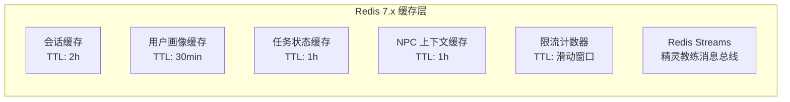

| 缓存 Key 模式 | 数据结构 | TTL | 用途 |
|-------------|---------|-----|------|
| `session:{session_id}` | Hash | 2h | 当前游戏会话状态（scene_id, chapter_id, cefr） |
| `user:{user_id}:profile` | Hash | 30min | 用户画像（cefr_level, subscription, preferred_language） |
| `quest:{quest_id}:state` | Hash | 1h | 任务进度快照 |
| `npc:{npc_id}:context:{user_id}` | Hash | 1h | NPC 对话上下文（历史 3 轮对话 + 好感度） |
| `ratelimit:{user_id}:llm` | String (INCR) | 60s 滑动窗口 | 云端 LLM 请求限流（60次/分钟） |
| `cooldown:{user_id}:spirit` | String | 5min | 精灵教练介入冷却 |
| `tts_cache:{text_hash}` | String | 24h | TTS 音频缓存（高频回复复用） |

**缓存失效策略**：
- 写入数据库后主动删除对应缓存（Cache-Aside + Write-Invalidate）
- 用户画像变更时广播失效消息，各服务本地缓存同步清除

### 4.4 数据流图

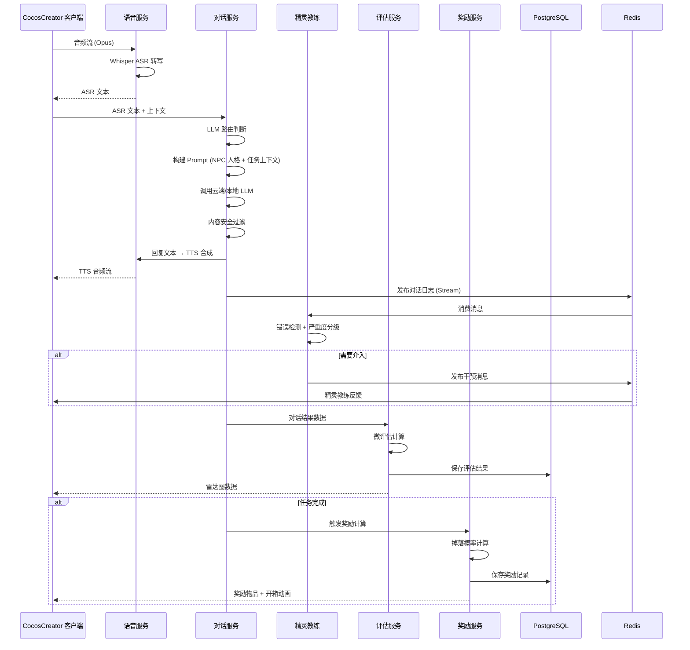

### 4.5 儿童数据保护实现

| 要求 | 实现方式 |
|------|---------|
| 逻辑隔离 | 独立 `child_data` Schema + RLS |
| 原始语音 24h 销毁 | Supabase Storage 设置 lifecycle policy: `DELETE after 24h` |
| 唤醒词音频不上传 | 客户端本地 TFLite 推理，音频数据不出设备 |
| 数据最小化 | 仅存储转写文本和结构化指标，不存储原始音频 |
| 一键删除 | 存储过程 `child_data.delete_child_data(parent_id, child_id)` 级联删除所有关联记录，72h SLA |
| 数据导出 | 存储过程 `child_data.export_child_data(child_id)` 生成 JSON 文件，30 天 SLA |
| 禁止训练用途 | `analytics_schema.llm_interaction_logs` 中标记 `is_child=true` 的记录，训练数据管道自动过滤 |

---

## 5. API 架构

### 5.1 API 网关路由设计

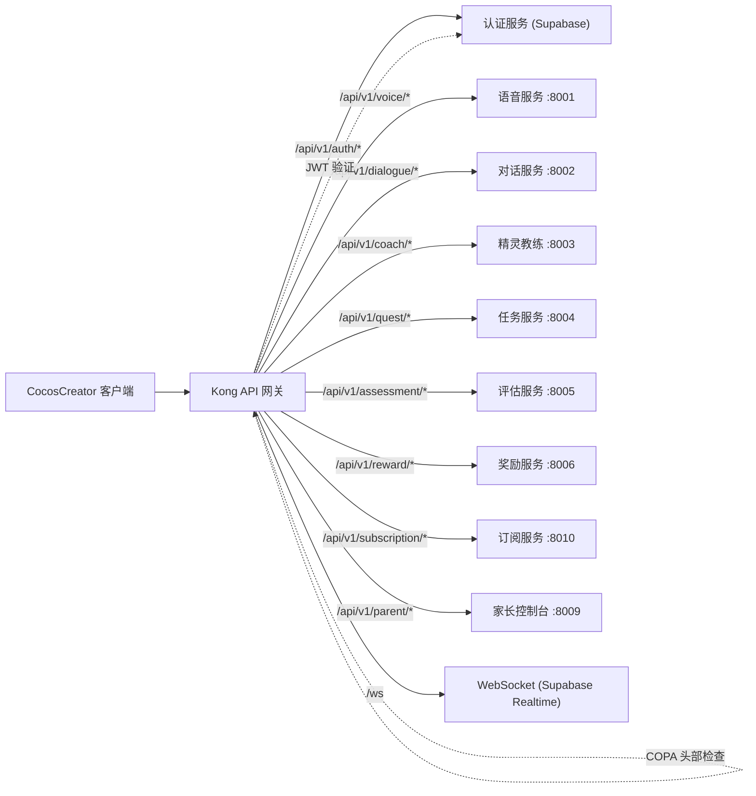

### 5.2 REST API 端点设计

所有 API 遵循 `/api/v1/{resource}` 路径约定。

#### 语音 API

| 方法 | 路径 | 描述 | 请求体 | 响应 | 延迟目标 |
|------|------|------|--------|------|---------|
| POST | `/api/v1/voice/asr` | 音频转文字 | Opus 音频流 | `{ text, confidence, language }` | P95 < 500ms |
| POST | `/api/v1/voice/tts` | 文字转语音 | `{ text, voice_id, language }` | `{ audio_url, duration_ms }` | P95 < 300ms |
| POST | `/api/v1/voice/pronunciation` | 发音评分 | `{ audio_ref, reference_text }` | `{ score, phoneme_errors }` | P95 < 500ms |

#### 对话 API

| 方法 | 路径 | 描述 | 请求体 | 响应 | 延迟目标 |
|------|------|------|--------|------|---------|
| POST | `/api/v1/dialogue/turn` | 发送一轮对话 | `{ session_id, npc_id, asr_text, context }` | `{ npc_response, tts_audio_ref, lxp_delta }` | P95 < 1.5s |
| GET | `/api/v1/dialogue/npcs` | 获取场景 NPC 列表 | `?scene_id=xxx` | `{ npcs: [{ id, name, type, voice_id }] }` | P95 < 200ms |
| POST | `/api/v1/dialogue/wake` | 唤醒精灵教练 | `{ session_id, wake_phrase }` | `{ coach_status, message }` | P95 < 300ms |

#### 任务 API

| 方法 | 路径 | 描述 | 请求体 | 响应 |
|------|------|------|--------|------|
| GET | `/api/v1/quests` | 获取可用任务列表 | `?type=main&scene_id=xxx` | `{ quests: [...] }` |
| POST | `/api/v1/quests/:id/accept` | 接受任务 | — | `{ quest, language_focus }` |
| POST | `/api/v1/quests/:id/complete` | 完成任务 | `{ accuracy, fluency, vocabulary }` | `{ lxp, reward_items, assessment }` |
| GET | `/api/v1/quests/daily` | 获取今日日常任务 | — | `{ quests: [...], reset_at }` |

#### 评估 API

| 方法 | 路径 | 描述 | 请求体 | 响应 |
|------|------|------|--------|------|
| GET | `/api/v1/assessment/micro/:session_id` | 获取微评估结果 | — | `{ radar: { accuracy, fluency, vocabulary } }` |
| GET | `/api/v1/assessment/cefr` | 获取当前 CEFR 等级 | — | `{ level, progress_to_next }` |
| POST | `/api/v1/assessment/periodic` | 触发阶段评估 | `{ session_id }` | `{ report_url, cefr_mapped }` |

#### 奖励 API

| 方法 | 路径 | 描述 | 请求体 | 响应 |
|------|------|------|--------|------|
| GET | `/api/v1/rewards/showcase` | 获取奖励展示厅 | — | `{ items, equipped, placed_decorations }` |
| POST | `/api/v1/rewards/equip` | 装备物品 | `{ item_id }` | `{ success, updated_showcase }` |
| GET | `/api/v1/rewards/progress` | 获取奖励进度 | — | `{ next_reward, progress_pct }` |

### 5.3 错误响应格式

```json
{
    "error": {
        "code": "ASR_TIMEOUT",
        "message": "语音转文字超时，请重试",
        "details": {
            "retry_after": 2,
            "fallback_available": true
        }
    }
}
```

### 5.4 错误码命名规范

| 前缀 | 服务 | 示例 |
|------|------|------|
| `AUTH_` | 认证 | `AUTH_EXPIRED`, `AUTH_INVALID_TOKEN` |
| `ASR_` | 语音识别 | `ASR_TIMEOUT`, `ASR_LOW_CONFIDENCE` |
| `TTS_` | 语音合成 | `TTS_FAILED`, `TTS_UNSUPPORTED_LANGUAGE` |
| `LLM_` | LLM | `LLM_RATE_LIMITED`, `LLM_FALLBACK_TO_LOCAL` |
| `QUEST_` | 任务 | `QUEST_LOCKED`, `QUEST_PREREQUISITE_NOT_MET` |
| `CONTENT_` | 内容安全 | `CONTENT_BLOCKED`, `CONTENT_FLAGGED_FOR_REVIEW` |
| `CHILD_` | 儿童模式 | `CHILD_TIME_LIMIT_REACHED`, `CHILD_SOCIAL_BLOCKED` |

### 5.5 消息总线设计（Redis Streams）

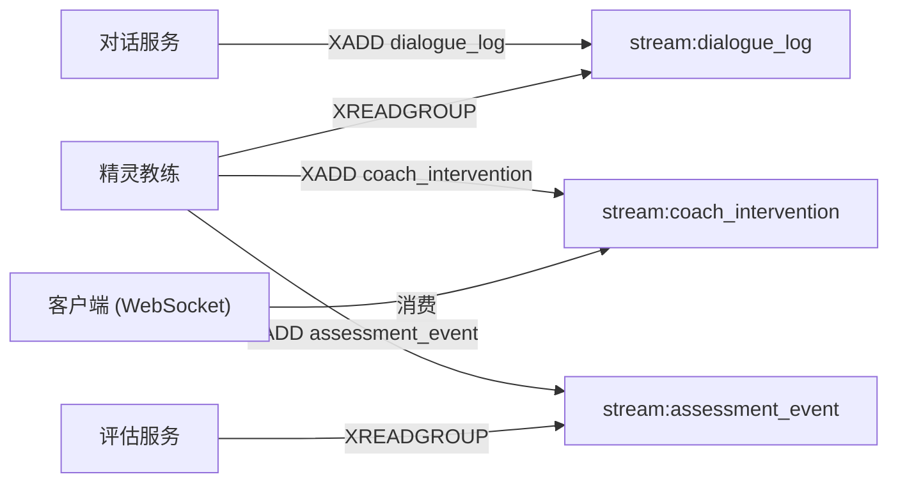

**Stream 定义**：

| Stream | 生产者 | 消费者 | 消息示例 | 保留时间 |
|--------|--------|--------|---------|---------|
| `stream:dialogue_log` | 对话服务 | 精灵教练 | `{ session_id, turn_id, asr_text, npc_response, npc_id }` | 24h |
| `stream:coach_intervention` | 精灵教练 | 客户端 WebSocket | `{ session_id, type, text, visual_hint, severity }` | 1h |
| `stream:assessment_event` | 精灵教练 | 评估服务 | `{ session_id, error_type, severity, suggestion_text }` | 7d |
| `stream:quest_events` | 任务服务 | 奖励服务 | `{ quest_id, user_id, status, scores }` | 24h |

### 5.6 WebSocket 实时推送

使用 Supabase Realtime (PostgreSQL WAL → WebSocket) 推送以下事件：

| 事件类型 | 触发条件 | 客户端行为 |
|---------|---------|-----------|
| `coach_hint` | 精灵教练发布干预消息 | 播放精灵动画 + 语音提示 |
| `quest_update` | 任务进度变更 | 更新任务面板 |
| `reward_unlock` | 新奖励获得 | 触发开箱动画 |
| `time_warning` | 儿童模式时间即将到期 | 精灵语音提醒 |
| `cefr_level_up` | CEFR 等级提升 | 播放升级动画 |

---

## 6. 安全架构

### 6.1 认证与授权架构

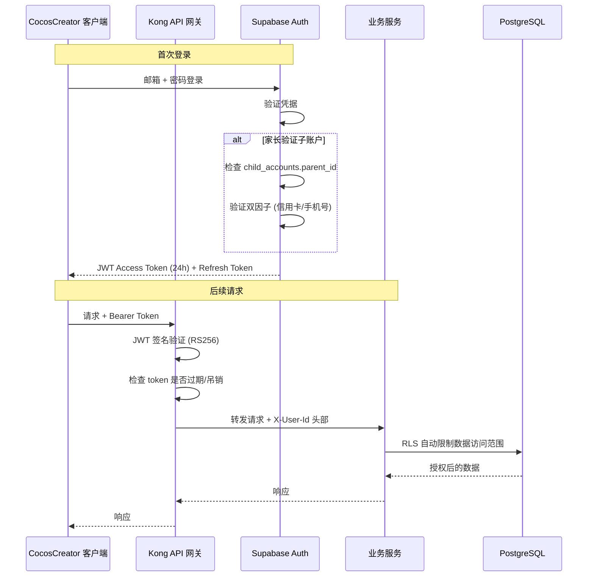

**认证流程细节**：

| 组件 | 技术 | 配置 |
|------|------|------|
| 身份提供商 | Supabase Auth (GoTrue) | JWT RS256, Access Token 24h, Refresh Token 30d |
| 家长子账户绑定 | child_accounts.parent_id FK + RLS | 子账户无独立登录，须由家长端启动 |
| 儿童账户验证 | 邮箱 OTP + 信用卡 CVV 校验 | COPPA 可核实家长同意 |
| 令牌刷新 | 静默刷新中间件 | 在 Access Token 过期前 1h 自动刷新 |
| 会话吊销 | Redis 黑名单 | 登出时将 JTI 加入黑名单至 Token 过期 |

### 6.2 内容安全双层过滤

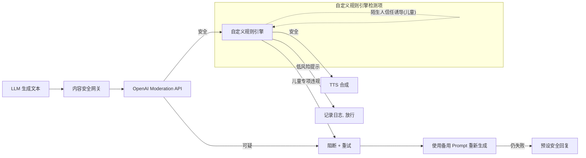

**规则引擎实现**：使用 AJV JSON Schema 校验 + 自定义关键词黑名单：

```typescript
// 儿童专项检测规则示例
const childSafetyRules = {
    blockedPatterns: [
        /meet.{0,10}alone/i,           // 诱导单独见面
        /don.?t.{0,10}tell.{0,10}parent/i,  // 诱导隐瞒家长
        /you.{0,10}look.{0,10}(fat|ugly)/i,  // 体像暗示
        /scared|afraid|don.?t.{0,5}cry/i,    // 恐吓性语言
    ],
    maxRetryCount: 2,
    fallbackResponses: {
        npc_error: "嗯……让我想想怎么回答你。请稍等一下哦！",
        coach_error: "这个问题很有意思，我们下次再详细讨论吧！",
    }
};
```

**人工审核流水线**（异步，不影响实时交互）：

```
每日随机 5% 对话样本 → 审核队列 (Strapi) → 人工审核员标记 → 问题 NPC 触发计数 → >3 次自动下线
```

### 6.3 数据保护矩阵

| 数据类别 | 加密方式 | 存储位置 | 保留期限 | 访问控制 |
|---------|---------|---------|---------|---------|
| JWT Token | RS256 签名 | 客户端内存 | 24h | — |
| 用户 PII (邮箱、姓名) | AES-256 字段加密 | PostgreSQL | 账户存续期 | RLS 行级隔离 |
| 儿童账户数据 | AES-256 字段加密 | child_data Schema | 账户存续期 | RLS + Schema 隔离 |
| 原始语音音频 | 传输加密 (TLS 1.3) | Supabase Storage | 24h 自动销毁 | 仅语音服务可写 |
| ASR 转写文本 | 传输加密 (TLS 1.3) | PostgreSQL dialogue_turns | 90d (儿童: 30d) | RLS |
| TTS 合成音频 | 传输加密 (TLS 1.3) | Supabase Storage | 30d | 公开读取 |
| LLM 交互日志 | 传输加密 (TLS 1.3) | analytics Schema | 180d | 仅分析服务 |
| 内容审计日志 | 传输加密 (TLS 1.3) | analytics Schema | 永久 | 审核员只读 |
| 支付信息 | Stripe Tokenization | Stripe (不存本地) | — | Stripe PCI DSS |

### 6.4 儿童模式安全实现

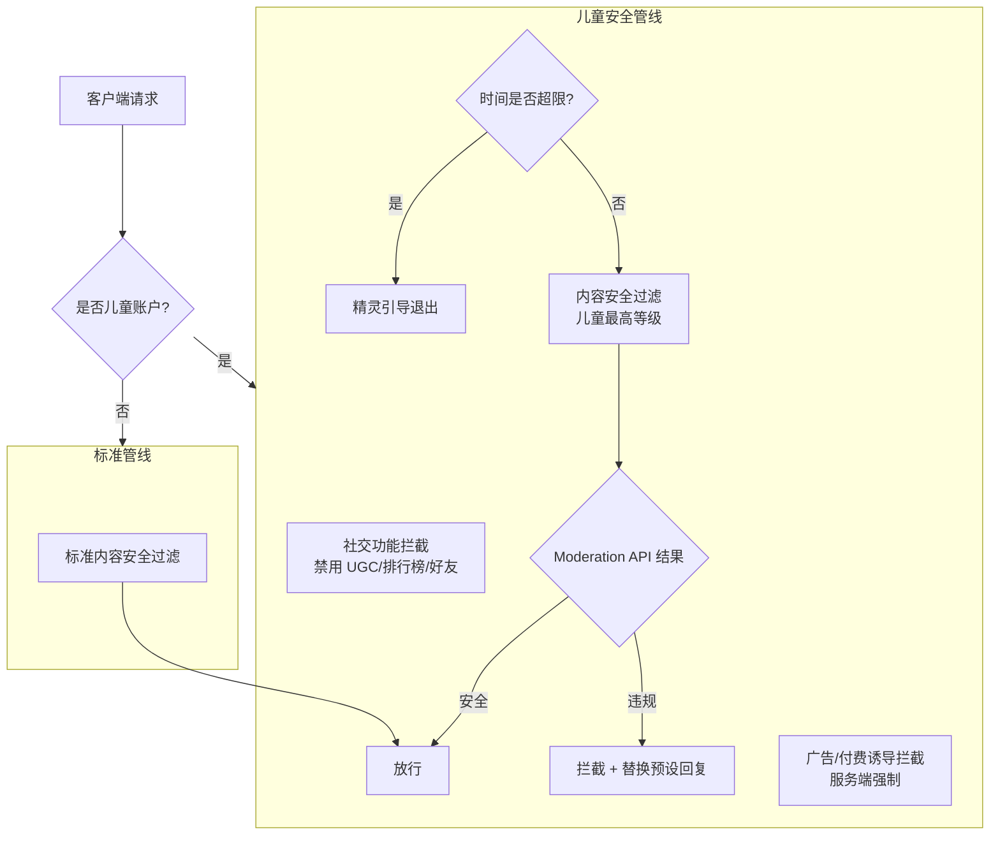

### 6.5 LLM API 密钥管理

| 密钥 | 存储方式 | 轮换周期 | 监控 |
|------|---------|---------|------|
| OpenAI API Key | AWS Secrets Manager / Supabase Vault | 90 天 | 用量异常告警 |
| Anthropic API Key | AWS Secrets Manager / Supabase Vault | 90 天 | 用量异常告警 |
| ElevenLabs API Key | AWS Secrets Manager / Supabase Vault | 90 天 | 用量异常告警 |
| Stripe Secret Key | AWS Secrets Manager / Supabase Vault | 180 天 | 访问日志审计 |

**环境变量注入流程**：CI/CD Pipeline 从 Secret Manager 读取 → 注入容器环境变量 → 服务启动时验证密钥有效性 → 无效则启动失败（Fail-Safe）。

### 6.6 API 速率限制

| 端点 | 限流策略 | 限制值 | 超限响应 |
|------|---------|--------|---------|
| `/api/v1/dialogue/*` | 滑动窗口 (Redis) | 60 次/分钟/用户 | 429 + 降级至本地 LLM |
| `/api/v1/voice/asr` | 滑动窗口 (Redis) | 30 次/分钟/用户 | 429 + 预设回复 |
| `/api/v1/voice/tts` | 滑动窗口 (Redis) | 30 次/分钟/用户 | 429 + 缓存命中 |
| `/api/v1/coach/*` | 固定窗口 (Redis) | 120 次/分钟/用户 | 429 |
| 全局 | Kong Rate Limiting | 1000 次/分钟/IP | 429 |

---

## 7. 基础设施架构

### 7.1 云基础设施选型

**首选云平台：AWS**

| 组件 | AWS 服务 | 用途 |
|------|---------|------|
| 容器编排 | Amazon ECS (Fargate) | 无服务器容器运行微服务 |
| API 网关 | Application Load Balancer + Kong 容器 | 请求路由 |
| 数据库 | Supabase 自托管 (EC2 + RDS PostgreSQL) | 主数据存储 |
| 缓存 | Amazon ElastiCache (Redis 7) | 会话缓存 + 消息总线 |
| 对象存储 | Amazon S3 | TTS 音频 + 游戏资源 |
| CDN | CloudFront | 全球资源分发 |
| 密钥管理 | AWS Secrets Manager | API 密钥安全存储 |
| 监控 | Amazon CloudWatch + Grafana | 指标与日志 |
| CI/CD | GitHub Actions | 构建与部署自动化 |
| DNS | Amazon Route 53 | 域名管理 |

**备选方案**：Supabase Cloud (Managed) 减少运维负担，适合 Phase 0-1。

### 7.2 部署架构

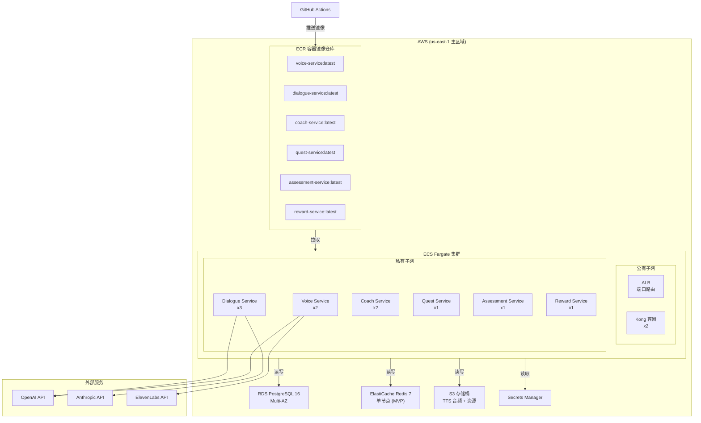

### 7.3 容器配置（MVP 基准）

| 服务 | CPU | 内存 | 副本数 | 健康检查 | 自动扩缩 |
|------|-----|------|--------|---------|---------|
| Kong | 0.5 vCPU | 512MB | 2 | HTTP /status | P95 延迟 > 500ms → +1 |
| Voice Service | 2 vCPU | 4GB | 2 | HTTP /health | ASR 队列深度 > 50 → +1 |
| Dialogue Service | 1 vCPU | 1GB | 3 | HTTP /health | QPS > 200 → +1 |
| Coach Service | 1 vCPU | 1GB | 2 | HTTP /health | Stream 积压 > 1000 → +1 |
| Quest Service | 0.5 vCPU | 512MB | 1 | HTTP /health | 固定 1 副本 |
| Assessment Service | 1 vCPU | 2GB | 1 | HTTP /health | 固定 1 副本 |
| Reward Service | 0.5 vCPU | 512MB | 1 | HTTP /health | 固定 1 副本 |

### 7.4 CI/CD Pipeline

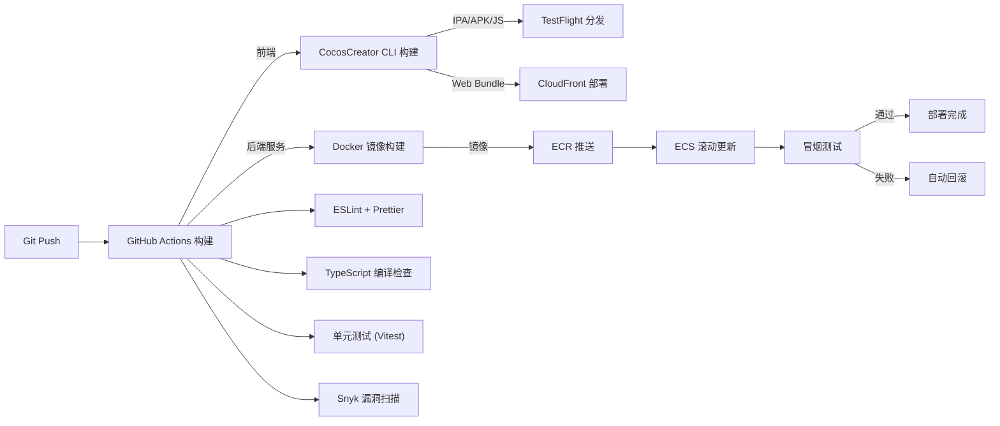

**Pipeline 质量门控**：

| 检查项 | 工具 | 阈值 | 失败动作 |
|--------|------|------|---------|
| 代码风格 | ESLint + Prettier | 0 错误 | 构建失败 |
| 类型检查 | TypeScript `--noEmit` | 0 错误 | 构建失败 |
| 单元测试 | Vitest | 覆盖率 >= 80% | 构建失败 |
| 安全扫描 | Snyk | 0 Critical, 0 High | 构建失败 |
| 冒烟测试 | Playwright API 测试 | 全部通过 | 回滚 |

### 7.5 监控与告警

| 指标 | 工具 | 阈值 | 告警方式 |
|------|------|------|---------|
| 服务可用性 | CloudWatch | < 99.5% 月度 | PagerDuty |
| P95 语音管线延迟 | CloudWatch + Datadog APM | > 1.5s | Slack + PagerDuty |
| LLM API 费用 | 自定义脚本 (每日汇总) | > 150% 基准 | Slack + 邮件 |
| 数据库连接池 | CloudWatch RDS | > 80% | Slack |
| Redis 内存使用 | CloudWatch ElastiCache | > 80% | Slack |
| 内容安全拦截率 | 自定义指标 | > 5% (可能 Prompt 问题) | Slack |
| 儿童模式时间拦截 | 自定义指标 | 监控趋势 | 周报 |
| 崩溃率 | Sentry | > 0.5% | PagerDuty |

### 7.6 扩展策略（Phase 2 → Phase 3）

| 阶段 | 并发用户 | 架构调整 |
|------|---------|---------|
| MVP (Phase 1) | < 1000 | 单区域 (us-east-1), Redis 单节点 |
| Beta (Phase 2) | < 5000 | Redis 集群, Dialogue 服务扩至 5 副本, 数据库读副本 |
| 正式发布 (Phase 3) | < 50000 | 多区域 (us-east-1 + eu-west-1), ECS Auto Scaling, CDN 全球分发, 数据库分片 |

---

## 8. MVP 范围定义

### 8.1 MVP 边界（基于 SRS Phase 1 MoSCoW）

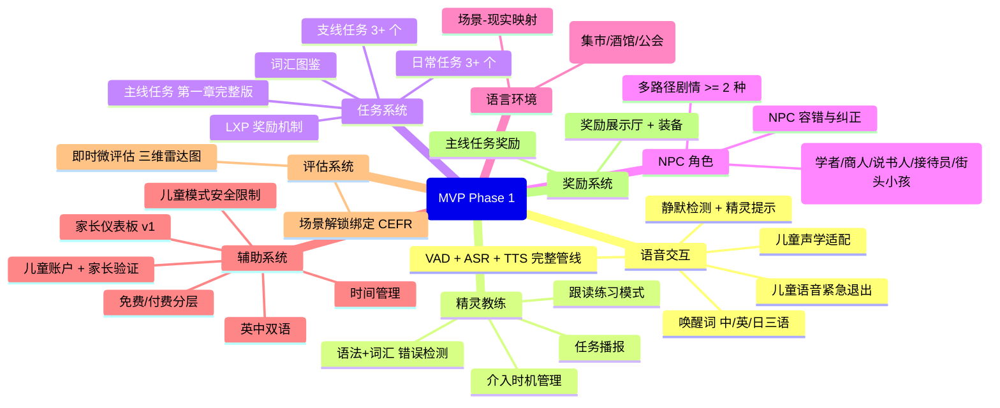

### 8.2 MVP 明确排除范围

| 功能 | 排除原因 | 计划阶段 |
|------|---------|---------|
| 多 NPC 音色 TTS（8+ 种） |  ElevenLabs 音色配置工作量，MVP 用 5 种基础音色即可 | Phase 2 |
| 发音评分 | 需要 CMU 音素字典 + 音素对齐模型，MVP 不做 | Phase 2 |
| NPC 动态记忆（完整版） | MVP 做基础关键词记忆即可 | Phase 2 |
| 精灵语音人格选择（3 种） | MVP 固定温暖型 | Phase 2 |
| 语言小贴士 | MVP 不做文化知识插入 | Phase 2 |
| 离线降级模式 | MVP 要求网络连接 | Phase 2 |
| 紧急事件/文化/翻译任务 | MVP 仅主线+支线+日常 | Phase 2 |
| NPC 好感度系统 | MVP 不做 | Phase 2 |
| CEFR 里程碑测试 | MVP 仅场景解锁绑定 | Phase 2 |
| B2B 教师后台 | MVP 不做 | Phase 4 |
| 装饰道具世界放置 | MVP 展示厅查看+装备即可 | Phase 2 |
| 日文/韩文/西班牙文 | MVP 仅英中双语 | Phase 3+ |

### 8.3 MVP 功能优先级矩阵

| Must (强制完成) | Should (尽量完成) |
|----------------|------------------|
| 语音管线端到端 (FR-V-001) | 错误图谱基础版 (FR-S-002) |
| 唤醒词三语支持 (FR-V-002) | 双语动态比例 (FR-S-006) |
| 儿童声学适配 (FR-V-003) | 本地 LLM 离线基础辅导 (FR-S-009) |
| 静默检测精灵提示 (FR-V-006) | NPC 动态记忆基础版 (FR-N-002) |
| 儿童语音退出 (FR-V-008) | NPC 渐进复杂度 (FR-N-004) |
| 精灵错误检测 (FR-S-001) | 阶段评估基础版 (FR-E-002) |
| 精灵任务播报 (FR-S-003) | 支线任务奖励 (FR-RW-002) |
| 精灵跟读练习 (FR-S-007) | 日常+连续登录奖励 (FR-RW-003) |
| 主线任务 (FR-Q-001) | 精灵奖励进度播报 (FR-RW-007) |
| 支线+日常任务 (FR-Q-002, Q-003) | — |
| LXP 机制 (FR-Q-007) | — |
| 5 种 NPC (FR-N-001) | — |
| 3 场景 (FR-L-001, L-002) | — |
| 儿童账户+时间+仪表板 (FR-A-001~004) | — |
| 免费+付费分层 (FR-A-005) | — |
| 英中双语 (FR-A-008) | — |
| 微评估雷达图 (FR-E-001) | — |
| 场景解锁绑定 (FR-E-006) | — |
| 主线奖励+展示厅 (FR-RW-001, RW-005) | — |

---

## 9. 技术风险评估

### 9.1 风险矩阵

| 编号 | 风险描述 | 影响 | 概率 | 等级 | 缓解策略 | 应急方案 |
|------|---------|------|------|------|---------|---------|
| R01 | **ASR 儿童语音识别率低** | 核心交互管线失效 | 中 | **高** | Phase 0 即进行儿童声学适配测试；使用儿童语音数据集微调 Whisper | 增加 Whisper large-v3 模型 + 儿童语音 prompt engineering；必要时接入 Azure Speech (儿童声学模型更成熟) |
| R02 | **语音管线端到端延迟超标** | 用户体验差，失去沉浸感 | 高 | **高** | Phase 0 建立延迟基线；Opus 音频压缩；LLM 流式输出 + TTS 增量合成 | 降级至预设回复；启用本地 LLM 快速响应 |
| R03 | **LLM API 成本失控** | 预算超支，产品不可持续 | 中 | **高** | 本地 LLM 分担简单任务；请求缓存（TTS 音频缓存高频回复）；每日费用 150% 告警；Prompt token 优化 | 启用更便宜模型（GPT-4o-mini）；降低调用频率 |
| R04 | **唤醒词误触发率高** | 精灵频繁弹出，干扰体验 | 中 | 中 | Phase 0 测试不同环境噪音下的误触发率；调整 TFLite 模型阈值 | 降低灵敏度 + 增加冷却时间（30s 内不重复触发） |
| R05 | **LLM 生成内容安全过滤失败** | 违反 COPPA，法律风险 | 低 | 中 | 双层过滤（Moderation API + 规则引擎）；红队测试；人工抽检 5% | 紧急 NPC 下线机制；预设回复兜底 |
| R06 | **CocosCreator 移动端内存超标** | 应用崩溃，体验差 | 中 | 中 | 资源按需加载；音频流式播放；Texture 压缩；内存 Profiling 集成 CI | 降低资源质量；场景拆分更细 |
| R07 | **COPPA/GDPR-K 合规未通过** | 无法上架，法律处罚 | 低 | 低 | Phase 0 完成 PIA；法务全程参与；Beta 阶段第三方审计 | 延迟发布至合规通过 |
| R08 | **ElevenLabs TTS 不支持目标语言** | 功能不可用 | 低 | 低 | Phase 0 验证 TTS 语言覆盖 | 备用 Azure Speech TTS |
| R09 | **Apple App Store 儿童类审核严格** | 上架延迟 | 中 | 中 | 提前 4 周提交；参考同类通过 App 设计；确保家长验证流程完整 | 先发布 Web 版本 |
| R10 | **本地 LLM (llama.cpp) 推理质量不足** | 离线体验差 | 中 | 中 | Phase 0 测试量化模型质量（Q4_K_M / Q5_K_M）；选择教育微调模型 | 云端 LLM 降级优先于本地低质量回复 |

### 9.2 高风险专项分析

#### R01: ASR 儿童语音识别率

**问题**：Whisper 模型训练数据以成人语音为主，对 6-13 岁儿童的童声（200-400Hz 声高范围）和发音不标准识别率可能低于 85% 要求。

**缓解措施**：
1. Phase 0 收集儿童语音测试集（至少 100 名 6-13 岁儿童样本）
2. 测试 Whisper large-v3 在儿童语音上的基准准确率
3. 如果 < 85%，使用儿童语音数据集进行 LoRA 微调
4. 测试 Azure Speech SDK 的儿童声学模型作为备用

**验证指标**：
- Phase 0 结束时：儿童语音识别率 >= 85%
- Phase 1 验收：儿童语音识别率 >= 85%（独立测试集）

#### R02: 语音管线延迟

**问题**：VAD → ASR → LLM → TTS 端到端链路涉及 4 个网络往返，P95 < 1.5s 目标极具挑战。

**延迟预算分配**：

| 环节 | 预算 | 技术实现 |
|------|------|---------|
| VAD 端点检测 | < 100ms | 本地 Silero VAD，帧级处理 |
| 音频上传 (Opus) | < 150ms | 8kbps 压缩，HTTP/2 流式 |
| ASR 转写 | < 500ms | Whisper API streaming 模式 |
| LLM 生成 | < 600ms | 流式输出，首 token < 200ms |
| TTS 合成 | < 300ms | ElevenLabs Turbo v2.5 流式 |
| 音频下载+播放 | < 150ms | 流式缓冲，首帧即播 |
| **总计** | **< 1.8s** | **目标 P95 < 1.5s** |

**优化手段**：
- LLM 和 TTS 并行化：LLM 生成到第 N 个 token 时即开始 TTS 合成（Pipeline 重叠）
- 预连接池：保持到 ASR/LLM/TTS 服务的 HTTP 连接常开
- 区域就近部署：LLM API 选择离用户最近的区域

#### R03: LLM API 成本

**问题**：语音交互每轮对话消耗 ~500 input tokens + ~200 output tokens，日活 1000 用户 × 每用户 50 轮 = 50000 轮/天 → 约 $50-100/天（GPT-4o 定价）。

**成本控制矩阵**：

| 策略 | 预计节省 | 实施阶段 |
|------|---------|---------|
| 本地 LLM 处理简单任务（30% 流量） | -30% | Phase 1 |
| TTS 音频缓存（高频回复复用） | -15% | Phase 1 |
| Prompt 压缩（System Prompt 精简至 500 tokens） | -10% | Phase 1 |
| GPT-4o-mini 用于非关键路径 | -40%（该路径） | Phase 2 |
| 多供应商智能路由（低价优先） | -10% | Phase 2 |

---

## 10. 开发阶段规划

### 10.1 总体时间线

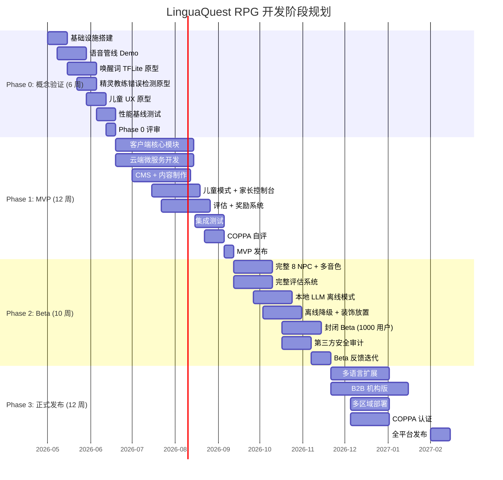

### 10.2 Phase 0 — 概念验证（2026 Q2，6 周）

**目标**：验证核心技术可行性，建立性能基线，消除最大技术风险。

**团队配置**：
- 1 名后端工程师（语音管线 + LLM 集成）
- 1 名 CocosCreator 工程师（客户端 Demo + 唤醒词）
- 1 名 AI 工程师（精灵教练原型）
- 1 名产品经理（需求确认 + 性能基线记录）

**里程碑交付物**：

| 周次 | 交付物 | 验收标准 |
|------|--------|---------|
| 第 1 周 | 基础设施就绪（AWS 环境、CI/CD Pipeline、Supabase 初始化） | 服务可部署、数据库可连接 |
| 第 2-3 周 | 语音管线 Demo | 唤醒词→ASR→LLM→TTS 端到端可运行，记录延迟数据 |
| 第 2-4 周 | 唤醒词 TFLite 模型 | 中/英唤醒词，误触发 < 1次/小时，响应 < 300ms |
| 第 3-4 周 | 精灵教练错误检测原型 | 可检测至少 1 类语法错误（如时态），延迟 < 800ms |
| 第 4-5 周 | 儿童 UX 原型 | 家长创建子账户流程可运行 |
| 第 5-6 周 | 性能基线报告 | 各组件延迟数据、瓶颈分析、优化建议 |

**退出标准**：
- [ ] 语音管线 Demo 端到端延迟 P95 数据已记录
- [ ] 唤醒词响应 < 300ms，误触发 < 1次/小时
- [ ] 精灵教练可检测并反馈至少 1 类错误
- [ ] 儿童账户创建原型可用
- [ ] 云端 LLM + 本地 LLM 均可正常调用
- [ ] 性能基线报告完成，识别出所有 > 100ms 的瓶颈点

### 10.3 Phase 1 — MVP（2026 Q3，12 周）

**目标**：交付第一章完整版（3 场景、5 NPC、英中双语、儿童模式、家长控制台）。

**团队配置**（10-12 人）：
- 2 名 CocosCreator 工程师（客户端模块并行开发）
- 3 名后端工程师（微服务开发）
- 1 名 AI/Python 工程师（语音服务 + 评估服务）
- 1 名前端工程师（家长控制台 Next.js）
- 1 名 QA 工程师（自动化测试 + 性能测试）
- 1 名产品经理 + 1 名 UI/UX 设计师
- 0.5 名法务/合规专员

**开发并行策略**：

| 时间段 | 并行工作流 | 负责团队 |
|--------|-----------|---------|
| 第 1-4 周 | 客户端：音频管线、VAD、唤醒词、场景加载 | 客户端组 |
| 第 1-4 周 | 云端：对话服务、语音服务、认证服务 | 后端组 |
| 第 1-4 周 | CMS：NPC 对话库（5 NPC × 100+ 提示词模板） | 内容组 |
| 第 5-8 周 | 客户端：任务 UI、精灵 UI、奖励展示厅 | 客户端组 |
| 第 5-8 周 | 云端：任务服务、精灵教练、奖励服务 | 后端组 |
| 第 5-8 周 | 家长控制台 Web 端 | 前端组 |
| 第 9-10 周 | 儿童模式全链路集成 + 安全测试 | 全团队 |
| 第 11-12 周 | 集成测试 + 性能优化 + COPPA 自评 | QA + 全团队 |

**MVP 验收标准**：
- [ ] SRS Phase 1 所有 Must 需求通过测试
- [ ] 语音管线 P95 < 1.5s
- [ ] 儿童模式全流程通过安全审核
- [ ] 崩溃率 < 0.5%
- [ ] COPPA 自评通过

### 10.4 Phase 2 — Beta 测试（2026 Q4，10 周）

**目标**：封闭 Beta（1000 名用户含 200 名儿童），完善评估系统，建立 AI 对话质量基准。

**重点功能**：
- 8 种完整 NPC + 多音色 TTS
- 发音评分系统
- 完整错误图谱 + 趋势分析
- 精灵语音人格选择（3 种）
- 本地 LLM 离线模式
- 阶段性综合评估 + CEFR 对标
- NPC 好感度系统
- 装饰道具世界放置

**Beta 验证重点**：
- 儿童 ASR 实际识别率（200 名儿童真实数据）
- LLM 对话质量评分（用户反馈收集）
- 内容安全过滤有效率（红队测试）
- 系统稳定性（7×24 小时运行）

### 10.5 Phase 3 — 正式上线（2027 Q1+，12 周）

**目标**：全平台发布、多语言扩展、B2B 机构版、CEFR 认证。

**重点功能**：
- 多语言扩展（日语、韩语、西班牙语）
- B2B 教师管理后台 + 班级报告
- 多区域部署（us-east-1 + eu-west-1）
- COPPA Safe Harbor 认证（PRIVO/KidSAFE）
- CEFR 官方认证体系（Phase 5 完成）
- 企业培训版探索

---

## 附录 A：架构决策记录 (ADR)

### ADR-001: 选择 Supabase 而非 Firebase 作为主数据存储

**状态**：已采纳
**背景**：SRS 允许 Firebase 或 Supabase 二选一。
**决策**：选择 Supabase (PostgreSQL)。
**理由**：
1. PostgreSQL RLS 天然支持行级数据隔离，满足 COPPA 儿童数据逻辑隔离要求
2. 数据驻留可控（可选择 AWS/GCP 区域），满足 GDPR 要求
3. 关系型数据模型更适合 SRS 中定义的复杂实体关系（20 张表 + 多对多关系）
4. 实时订阅功能覆盖客户端推送需求

### ADR-002: 精灵教练通过异步消息总线解耦

**状态**：已采纳
**背景**：精灵教练需要分析主对话流中的错误，但不能阻塞 NPC 回复。
**决策**：使用 Redis Streams 实现异步消息传递。
**理由**：
1. 对话管线必须低延迟（P95 < 1.5s），不能等待精灵分析
2. Redis Streams 提供持久化 + 消费者组，确保消息不丢失
3. 比 Kafka 轻量，适合 MVP 规模
4. 与 Redis 缓存复用同一基础设施

### ADR-003: LLM 智能路由采用规则引擎而非 AI 判断

**状态**：已采纳
**背景**：需要决定简单任务 vs 复杂任务的路由策略。
**决策**：基于任务类型的确定性规则路由。
**理由**：
1. 规则可预测、可调试、可审计
2. MVP 阶段任务类型有限（词汇解释/发音示范 → 本地，NPC 对话/精灵分析 → 云端）
3. 避免用 AI 判断 AI 任务引入额外延迟和不确定性

### ADR-004: 客户端选择 llama.cpp 而非 WebLLM/Ollama

**状态**：已采纳
**背景**：移动端本地 LLM 推理有多种引擎可选。
**决策**：选择 llama.cpp。
**理由**：
1. CocosCreator 可通过 C++ 插件集成 llama.cpp
2. Metal (iOS) / Vulkan (Android) GPU 加速支持成熟
3. 量化模型 (Q4_K_M) 在移动端 1-3B 模型表现可接受
4. WebLLM 仅支持 Web 端，Ollama 不适合嵌入式场景

---

## 附录 B：术语对照表

| 中文术语 | 英文术语 | 缩写 |
|---------|---------|------|
| 精灵教练 | Spirit Coach | Coach |
| 语言经验值 | Language Experience Points | LXP |
| 语音端点检测 | Voice Activity Detection | VAD |
| 自动语音识别 | Automatic Speech Recognition | ASR |
| 文字转语音 | Text-to-Speech | TTS |
| 欧洲语言共同参考框架 | Common European Framework of Reference | CEFR |
| 内容管理系统 | Content Management System | CMS |
| 密钥管理服务 | Key Management Service | KMS |
| 隐私影响评估 | Privacy Impact Assessment | PIA |
| 应用负载平衡器 | Application Load Balancer | ALB |
| 弹性容器服务 | Elastic Container Service | ECS |

---

*文档结束 — LinguaQuest RPG 架构设计文档 v1.0 (LQ-ARCH-001)*
