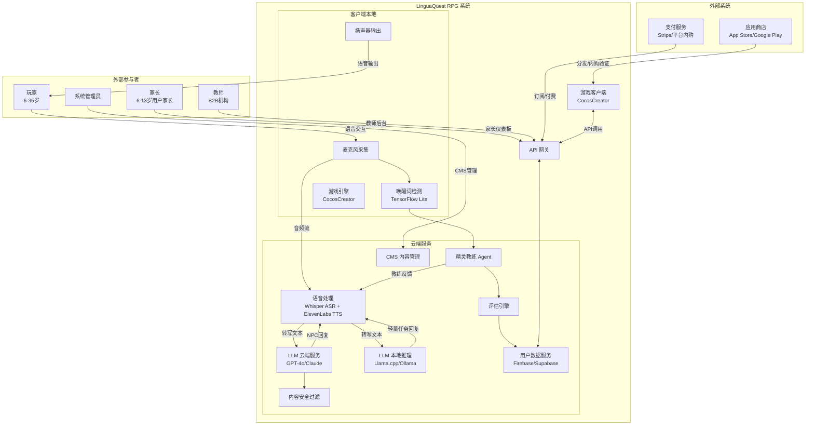
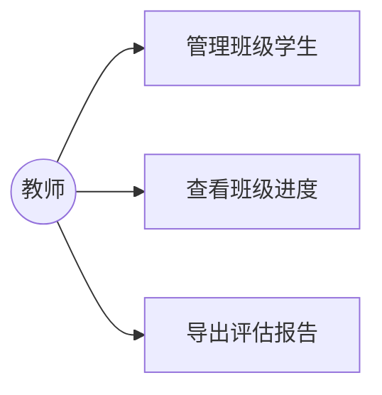

# LinguaQuest RPG — 软件需求规格说明书

**文档编号**：LQ-SRS-001
**版本**：1.0
**日期**：2026年4月
**关联文档**：LQ-PRJ-001（LinguaQuest RPG 项目说明书 v1.2）
**保密等级**：内部使用

| 项 | 内容 |
|---|---|
| 文档编号 | LQ-SRS-001 |
| 版本 | 1.0 |
| 创建日期 | 2026年4月 |
| 作者 | 需求分析团队 |
| 审核 | 产品负责人、技术架构师、语言教育专家 |
| 关联文档 | LQ-PRJ-001（项目说明书 v1.2） |
| 发行范围 | 内部项目成员、投资人（需保密协议） |

---

## 修订历史

| 版本 | 日期 | 修订内容 | 作者 |
|------|------|---------|------|
| 1.0 | 2026-04-15 | 初始版本，基于项目说明书 v1.2 提取全部需求 | 需求分析团队 |

---

## 第 1 章 引言

### 1.1 编写目的

本软件需求规格说明书（SRS）旨在为 LinguaQuest RPG 的开发团队提供明确、完整、可测试的需求基线。文档基于《LinguaQuest RPG 项目说明书》（LQ-PRJ-001 v1.2）进行需求提取与结构化，服务于以下目的：

- 为开发团队提供功能与非功能的实施依据
- 为 QA 团队提供测试用例设计的输入
- 为产品委员会提供需求评审与验收的对照基准
- 建立需求可追溯性（需求 ↔ 项目说明书 ↔ 测试用例）

### 1.2 文档范围

本 SRS 覆盖 LinguaQuest RPG 的全部系统需求，包括：

- 6 大核心系统功能需求（语音交互、精灵 AI 教练、任务、评估、NPC 角色、语言环境模拟）
- 辅助系统功能需求（儿童模式、家长控制、订阅管理、多语言支持、离线降级）
- 奖励系统功能需求（游戏内物品奖励：主角皮肤、精灵皮肤、装饰道具、称号）
- 非功能需求（性能、安全、可用性、可靠性、兼容性、可扩展性、本地化）
- 数据需求、接口需求、约束条件
- 需求优先级与分阶段发布映射

本 SRS 覆盖 Phase 0 至 Phase 5 的全部需求，并以 MoSCoW 方法标注各阶段优先级。

### 1.3 定义、缩略语与术语表

| 术语/缩略语 | 定义 |
|------------|------|
| LXP（Language Experience Points） | 游戏内语言经验值，综合准确性、流利度、词汇三维评分加权计算 |
| CEFR | 欧洲语言共同参考框架，A1-C2 六级语言能力标准 |
| 精灵教练 / Spirit Coach | 游戏内独立 AI 代理，扮演随身精灵提供语言辅导，通过唤醒词激活 |
| NPC（Non-Player Character） | 非玩家角色，由 AI 驱动的游戏世界居民 |
| ASR（Automatic Speech Recognition） | 自动语音识别，将玩家语音转为文字 |
| TTS（Text-to-Speech） | 文字转语音合成，用于 NPC 语音与精灵教练朗读 |
| VAD（Voice Activity Detection） | 语音端点检测，自动识别玩家发言开始与结束 |
| TTR（Type-Token Ratio） | 词汇多样性指数，衡量用词丰富程度 |
| LLM（Large Language Model） | 大语言模型，驱动 NPC 对话生成与教练分析，支持云端 API（GPT-4o / Claude）和本地推理（Llama.cpp / Ollama）两种部署模式 |
| 本地 LLM | 在设备本地或私有服务器运行的 LLM 推理引擎，适用于简单任务和离线场景 |
| COPPA | 美国儿童在线隐私保护法，适用于面向 13 岁以下用户的数字产品 |
| GDPR-K | 欧盟通用数据保护条例中关于未成年人的特别规定 |
| PIA（Privacy Impact Assessment） | 隐私影响评估，系统上线前对数据处理风险的结构化评审 |
| 唤醒词 | 触发精灵教练进入活跃状态的特定语音短语（中：「小灵」/ 英：「Hey Spark」/ 日：「スパーク」） |
| MoSCoW | 需求优先级分类方法：Must / Should / Could / Won't |
| KMS（Key Management Service） | 密钥管理服务，用于安全存储 API 密钥等敏感凭证 |
| CMS（Content Management System） | 内容管理系统，用于管理 NPC 对话库、任务脚本等内容 |

### 1.4 参考文档

| 文档 | 编号 | 版本 | 说明 |
|------|------|------|------|
| LinguaQuest RPG 项目说明书 | LQ-PRJ-001 | v1.2 | 本 SRS 的唯一需求来源 |
| IEEE 830-1998 | — | — | 软件需求规格说明书推荐实践 |
| CEFR 官方文件 | — | 2020 修订版 | 欧洲语言共同参考框架 |
| COPPA Rule | 16 CFR Part 312 | — | 美国儿童在线隐私保护法 |
| GDPR | EU 2016/679 | — | 欧盟通用数据保护条例 |

---

## 第 2 章 总体描述

### 2.1 产品视角

LinguaQuest RPG 是一款独立运行的移动端/Web 端 AI 驱动语言学习游戏。系统采用云端-客户端混合架构：游戏渲染与唤醒词检测在客户端本地执行，AI 对话生成、语音识别与合成、评估分析在云端执行。

#### 系统上下文图



### 2.2 产品功能概述

LinguaQuest RPG 由 6 大核心系统 + 辅助系统组成：

| 系统 | 一句话描述 |
|------|-----------|
| 语音交互系统 | 纯语音驱动的端到端交互管线（VAD→ASR→LLM→TTS），支持儿童声学适配 |
| 精灵 AI 教练系统 | 独立 AI Agent，提供实时错误检测、个性化纠错、任务播报与跨会话进度追踪 |
| 任务系统 | 6 种任务类型将语言学习目标转化为游戏驱动力，LXP 奖励与语言表现深度绑定 |
| 评估系统 | 5 维语言能力评估框架（语法/词汇/流利度/语用/听力），CEFR 对标与场景解锁联动 |
| NPC 角色系统 | 8+ 类 AI 驱动 NPC，具备动态记忆、容错纠正与渐进复杂度能力 |
| 语言环境模拟系统 | 8 大游戏场景映射现实交际语境，场景解锁与语言能力等级绑定 |
| 奖励系统 | 游戏内物品奖励：主角皮肤、精灵皮肤、装饰道具、称号/头衔、视觉特效，与语言学习进度深度绑定 |
| 辅助系统 | 儿童模式、家长控制、订阅管理、多语言支持、离线降级 |

### 2.3 用户角色模型

系统定义以下 5 类用户角色：

| 角色 | 描述 | 核心交互方式 | 关键约束 |
|------|------|-------------|---------|
| **儿童玩家**（6-13 岁） | 零基础或入门级学习者，无读写能力门槛 | 纯语音交互 | 儿童模式强制运行，家长账户绑定，时间管理，无社交功能 |
| **青少年/成人玩家**（13-35 岁） | 有一定学习基础，追求实际交际能力提升 | 语音交互 + 可选辅助设置 | 标准模式，可自定义精灵教练介入频率与双语比例 |
| **家长** | 6-13 岁儿童玩家的监护人 | Web/App 仪表板 | 可查看学习数据、管理时间、一键删除子账户数据 |
| **教师**（B2B） | 语言培训机构的教学管理人员 | Web 教师后台 | 班级管理、学生进度概览、批量评估报告导出 |
| **系统管理员** | 产品运营团队 | CMS 管理后台 | NPC 对话库管理、任务脚本更新、内容审核、安全监控 |

### 2.4 运行环境

| 环境维度 | 要求 |
|---------|------|
| **移动端（iOS）** | iPhone 8 及以上，iOS 15+，CocosCreator 客户端 |
| **移动端（Android）** | Android 10+，最低 4GB RAM，CocosCreator 客户端 |
| **Web 端** | Chrome / Safari / Firefox 最近两个主要版本，CocosCreator 客户端 |
| **音频设备** | 内置麦克风或外接麦克风（AirPods / 有线耳机） |
| **网络** | 4G+（完整 AI 体验）/ 3G（降级模式，预设 NPC 响应） |
| **云端** | AWS / GCP，支持多区域部署以满足数据驻留合规要求 |

### 2.5 设计与实现约束

- 游戏前端基于 CocosCreator 引擎（统一代码库，支持 iOS / Android / Web 多平台），全局禁用文字键盘输入组件
- LLM 支持两种部署模式：云端 API（GPT-4o / Claude）和本地推理（Llama.cpp / Ollama），按任务复杂度智能路由；本地推理适用于词汇解释、发音评分等简单任务
- 唤醒词模型必须在设备本地运行（TensorFlow Lite），体积 < 5MB
- 移动端内存约束：CocosCreator 客户端峰值内存 < 2GB
- 数据存储采用 Firebase 或 Supabase
- NPC 对话库、任务脚本通过 CMS 管理，支持热更新
- 儿童数据保护须满足 Privacy by Design 原则

### 2.6 假设与依赖

**假设**：
- 目标用户设备具备可用的麦克风和扬声器
- 用户处于相对安静的环境中（噪音 < 60dB），以确保 ASR 识别质量
- 目标语言（Phase 1：英语、中文）的 LLM 模型具备足够的教育对话质量
- ElevenLabs TTS 支持英语和中文的多人格音色
- 家长具备基本的智能手机操作能力以完成儿童账户创建

**依赖**：
- GPT-4o / Claude API 的持续可用性与价格稳定性；本地 LLM 模型（Llama.cpp / Ollama）需具备足够教育对话质量
- Whisper ASR 对儿童口音和非母语口音的识别准确度
- ElevenLabs TTS 对目标语言的语音合成质量
- Apple App Store / Google Play 的审核周期与政策
- 各地区儿童隐私保护法规的具体实施细则

---

## 第 3 章 功能需求 — 语音交互系统（FR-V）

语音交互系统是 LinguaQuest RPG 的核心输入输出层。采用纯语音交互设计——玩家与 NPC 的全部对话、精灵教练的唤醒与任务启动均通过语音完成，从根本上强制口语输出练习。

### 3.1 语音管线架构

系统采用以下管线处理语音交互，并支持云端/本地 LLM 智能路由：

```
设备麦克风 → VAD(端点检测) → ASR(语音转文字)
                                              ↓
                                    LLM 任务路由器
                                      /          \
                          云端 LLM API       本地 LLM 推理
                          (GPT-4o/Claude)   (Llama.cpp/Ollama)
                              /                    \
                        复杂对话              简单任务
                        (NPC回复/精灵分析)    (词汇解释/发音评分/跟读示范)
                              \                    /
                                    LLM 响应
                                              ↓
                                    TTS(语音合成) → 扬声器
                                                         ↓
                                              精灵教练 Agent(异步分析)
```

**LLM 任务路由策略**：
- **简单任务**（延迟敏感或离线优先）：词汇解释、发音评分示范、精灵教练跟读示范 → 路由至本地 LLM（< 7B 参数）
- **复杂任务**（质量优先）：NPC 对话生成、精灵教练错误分析、意图识别 → 路由至云端 LLM
- **降级策略**：云端 LLM 不可用时，自动降级至本地 LLM；本地 LLM 不可用时，使用预设回复

### 3.2 功能需求列表

| 需求编号 | 用户故事 | 验收标准 | 优先级 |
|---------|---------|---------|--------|
| FR-V-001 | 作为玩家，我希望通过麦克风自然说话与 NPC 交互，无需打字，以便获得沉浸式语言练习体验 | 1. VAD 自动检测发言起止；2. ASR 转写准确率 >= 90%（成人）；3. 端到端延迟 P95 < 1.5s | **Must** |
| FR-V-002 | 作为玩家，我希望说「小灵」/「Hey Spark」即可召唤精灵教练，以便随时获取语言帮助 | 1. 本地唤醒词模型 < 5MB；2. 误唤醒 < 1次/小时（静默环境）；3. 响应 < 300ms；4. 多语言唤醒词支持（中/英/日） | **Must** |
| FR-V-003 | 作为 6-13 岁儿童玩家，我希望系统能听懂我的声音，即使我发音不标准 | 1. 儿童专项 ASR 模型适配童声音高范围（200-400Hz）；2. 语速容差允许慢速 50%；3. 识别率 >= 85%；4. 儿童声纹唤醒模型识别率 >= 95% | **Must** |
| FR-V-004 | 作为玩家，我希望 NPC 对我说话时有不同的声音和个性，像真人在和我对话 | 1. TTS 支持 8+ 种 NPC 音色；2. 音色差异可感知（音调/语速/情感表达）；3. 每个 NPC 角色绑定固定音色 | Should |
| FR-V-005 | 作为玩家，我希望系统实时评价我的发音并给出改进建议 | 1. 基于 CMU 音素字典 + 音素对齐模型评分；2. 评分延迟 < 500ms；3. 提供音素级别纠错建议 | Should |
| FR-V-006 | 作为玩家，当我说不出来时，我希望精灵教练能给我提示而不是干等 | 1. 静默检测 5 秒触发精灵教练介入；2. 精灵以鼓励性语气轻声提示（如「你可以试着问问商人这个多少钱」）；3. 提示不超过 2 句；4. 不中断 NPC 对话流 | **Must** |
| FR-V-007 | 作为玩家，我希望即使在网络不好时也能继续基本游戏体验 | 1. 唤醒词检测完全本地离线运行；2. 断网时提供离线降级模式（预设 NPC 响应）；3. 恢复网络后自动同步数据 | Could |
| FR-V-008 | 作为儿童玩家，我希望说「我要休息」就能暂停游戏，不用找按钮 | 1. 儿童模式支持语音紧急退出；2. 响应 < 1s；3. 自动保存当前进度；4. 精灵语音确认保存并引导退出 | **Must** |

### 3.3 语音交互设计原则

- **容错性优先**：允许口音与语法错误，NPC 不因发音不标准而中断对话，保持沉浸感
- **多路径剧情**：同一任务支持多种口语表达路径，鼓励自由表达而非固定背诵
- **难度弹性**：NPC 语速与词汇复杂度随玩家能力评估结果动态调整
- **无键盘依赖**：全局禁用文字键盘输入组件，所有交互通过语音完成

---

## 第 4 章 功能需求 — 精灵 AI 教练系统（FR-S）

精灵 AI 教练（Spirit Coach）是独立运行的智能语言辅导代理，化身为玩家冒险者的随身精灵伴侣。教练通过专属唤醒词激活，以语音方式宣布与开启任务，在不破坏游戏沉浸感的前提下提供专业语言指导。

### 4.1 精灵教练架构

精灵教练作为独立 Agent 运行，与主对话系统解耦，通过消息总线异步通信：

```
主对话流: 玩家 → NPC 对话引擎 → NPC 回复
                    ↓ (异步推送)
精灵教练 Agent: 对话日志 → 错误检测 → 严重度分级 → 建议生成 → 介入时机判断
                    ↓ (条件触发)
教练反馈: 语音纠正 / 视觉提示 / 语言小贴士
```

### 4.2 功能需求列表

| 需求编号 | 用户故事 | 验收标准 | 优先级 |
|---------|---------|---------|--------|
| FR-S-001 | 作为玩家，我希望精灵教练在我犯语法错误时温柔纠正我，而不是让 NPC 中断对话 | 1. 错误检测延迟 < 800ms（P95）；2. 不中断 NPC 对话流；3. 以角色语音 + 视觉反馈（橙光）提示；4. 纠正语气鼓励性 | **Must** |
| FR-S-002 | 作为玩家，我希望精灵教练记住我常犯的错误，并在之后的练习中针对性训练 | 1. 跨会话错误图谱持久化存储；2. 每周生成错误趋势分析；3. 后续会话中针对高频错误提供强化练习机会 | Should |
| FR-S-003 | 作为玩家，我希望在任务开始前由精灵教练语音告知任务内容 | 1. 精灵主动飞出播报任务；2. 语音介绍任务目标 + 语言练习点；3. 播报时长 < 30s；4. 无需玩家唤醒 | **Must** |
| FR-S-004 | 作为玩家，我希望选择精灵教练的个性（温暖/严格/幽默） | 1. 3 种语音人格可选（温暖鼓励型/严格学术型/活泼幽默型）；2. 切换后即时生效；3. 影响反馈语气和用词风格；4. 幽默型仅限 13 岁以上用户 | Could |
| FR-S-005 | 作为玩家，我希望精灵教练不要过度打扰我，只在关键时刻介入 | 1. 介入频率可配置（默认每 3-5 分钟最多一次主动介入）；2. 仅严重错误才立即介入；3. 对话进行中不主动打断 | **Must** |
| FR-S-006 | 作为玩家，我希望精灵用我能理解的方式解释，新手时多母语、熟练后多目标语言 | 1. 双语比例根据 CEFR 等级动态调整（A1:90%母语 → B1:50% → C1:100%目标语言）；2. 儿童用户初次接触场景 90% 母语引导 + 10% 目标语言关键词 | Should |
| FR-S-007 | 作为玩家，我希望精灵教练示范正确发音并让我跟读 | 1. 「小灵，教我怎么说」触发跟读练习模式；2. 精灵语音示范标准表达；3. 等待玩家复述；4. 对复述进行评分与反馈 | **Must** |
| FR-S-008 | 作为玩家，我希望在对话自然停顿处听到语言小贴士（文化背景、语用知识） | 1. 在话轮间隔 > 3s 时判断是否插入小贴士；2. 每次游戏会话最多 2-3 次主动小贴士；3. 小贴士内容与当前场景和对话主题相关 | Could |
| FR-S-009 | 作为玩家，我希望在无网络时仍能获得基础的词汇解释和跟读反馈 | 1. 词汇解释、发音示范、跟读反馈等简单任务路由至本地 LLM；2. 离线时仍提供部分语言辅导功能；3. 恢复网络后自动切换回云端 LLM | Should |

### 4.3 唤醒词交互场景

| 交互场景 | 触发方式 | 精灵响应 |
|---------|---------|---------|
| 呼唤精灵寻求帮助 | 玩家说「小灵，帮帮我」 | 精灵飞出，语音询问需要什么协助 |
| 请精灵解释单词/句子 | 玩家说「小灵，这句话什么意思」 | 精灵用母语 + 目标语言双语解释 |
| 请精灵示范正确说法 | 玩家说「小灵，教我怎么说」 | 精灵语音示范标准表达并邀请跟读 |
| 任务自动开启 | 满足剧情触发条件 | 精灵主动飞出，语音宣布「新任务：……」 |
| 任务进度提示 | 玩家偏离任务方向 | 精灵轻声提醒「试试问问集市商人」 |
| 任务完成播报 | 完成条件达成 | 精灵语音播报「任务完成！你获得了……」 |
| 被动纠错触发 | 检测到严重发音/语法错误 | 精灵轻拍玩家肩膀（震动反馈）+ 语音轻柔纠正 |
| 儿童紧急退出 | 儿童玩家说「我要休息」 | 精灵自动保存进度并退出游戏 |

### 4.4 精灵角色设计规格

- **视觉**：萤火虫造型发光精灵，儿童友好的圆润外观，7 种可解锁外观皮肤
- **动画反馈**：飞行轨迹、翅膀频率、光晕颜色传达情绪（绿=正确，橙=建议，红=需纠正）
- **非侵入显示**：悬停于画面右下角，有内容时轻动提示；全屏沉浸模式下可设为仅语音

---

## 第 5 章 功能需求 — 任务系统（FR-Q）

任务系统将语言学习目标转化为具体的游戏驱动力，确保每个任务都绑定明确的语言练习点。

### 5.1 任务类型

| 任务类型 | 语言练习焦点 | 示例场景 |
|---------|-------------|---------|
| 主线任务 | 核心语法结构、完整话语组织能力 | 说服议会调查古代神殿的封印之谜 |
| 支线任务 | 特定词汇域、社交礼仪表达 | 帮助村民寻找失踪的山羊并写寻物启事 |
| 日常对话任务 | 问候、购物、问路等高频日常表达 | 在集市上购买冒险补给 |
| 紧急事件任务 | 紧迫语气、请求帮助、描述紧急情况 | 向城卫军报告山贼袭击事件 |
| 文化解锁任务 | 目标语言文化习俗、非语言礼仪知识 | 参加精灵族的月圆祭典 |
| 翻译/口译任务 | 跨语境语义转换能力 | 为不同族裔的 NPC 担任即时翻译 |

### 5.2 功能需求列表

| 需求编号 | 用户故事 | 验收标准 | 优先级 |
|---------|---------|---------|--------|
| FR-Q-001 | 作为玩家，我希望主线任务引导我学习核心语法结构并推动剧情 | 1. 每个主线任务绑定 1-2 个核心语法点；2. 完成后解锁下一区域/剧情节点；3. 多路径完成（>= 3 种口语表达路径） | **Must** |
| FR-Q-002 | 作为玩家，我希望有可选的支线任务让我练习特定词汇和社交表达 | 1. 支线任务不影响主线进度；2. 可自由选择接受/拒绝；3. 完成后获得额外 LXP 和 NPC 好感度 | Should |
| FR-Q-003 | 作为玩家，我希望每天有日常任务让我练习基础表达（问候、购物、问路） | 1. 每日重置 3 个日常任务；2. 难度匹配当前 CEFR 等级；3. 完成获得 LXP | Should |
| FR-Q-004 | 作为玩家，我希望有突发事件让我练习紧急情况下的语言表达 | 1. 随机触发紧急任务；2. 要求使用请求、描述紧急状况等特定语言功能；3. 完成时限 < 5 分钟 | Could |
| FR-Q-005 | 作为玩家，我希望有文化解锁任务让我了解目标语言国家的文化习俗 | 1. 文化任务包含文化背景语音讲解 + 角色扮演；2. 完成后解锁文化图鉴条目 | Could |
| FR-Q-006 | 作为玩家，我希望翻译/口译任务训练我在两种语言间切换的能力 | 1. 玩家为不同族裔 NPC 担任翻译；2. 需在母语和目标语言间准确传递信息；3. 翻译准确度纳入 LXP 评分 | Could |
| FR-Q-007 | 作为玩家，我希望任务奖励与语言表现挂钩，说得好奖励多 | 1. LXP = accuracy × 0.4 + fluency × 0.3 + vocabulary × 0.3；2. 评分透明显示（三维雷达图）；3. 奖励包括 LXP + 语言徽章 + NPC 好感度 + 游戏内奖励物品（皮肤/道具） | **Must** |
| FR-Q-008 | 作为玩家，我希望在对话中用到的新词自动收录到词汇图鉴中 | 1. 词汇自动收录 + 使用语境记录；2. 图鉴支持按场景/词性/时间筛选复习；3. 掌握度分级（new → learning → familiar → mastered） | Should |

### 5.3 任务奖励机制

- **语言经验值（LXP）**：按流利度（30%）、准确性（40%）、词汇丰富度（30%）三维评分加权
- **语言徽章**：解锁特定语言里程碑（如「首次完成 10 分钟无错对话」）
- **NPC 好感度**：语言表现影响 NPC 态度，高好感度解锁隐藏剧情与特殊任务
- **词汇图鉴**：对话中使用的新词自动收录，可在图鉴中复习与练习
- **游戏内奖励物品**：完成各类任务获得主角皮肤、精灵皮肤、装饰道具等视觉奖励

### 5.4 奖励系统

奖励系统为玩家提供丰富的游戏内视觉激励，与语言学习进度深度绑定。奖励分为以下类型：

#### 5.4.1 奖励类型

| 奖励类型 | 示例 | 稀有度层级 | 获得方式 |
|---------|------|-----------|---------|
| 主角皮肤 | 冒险者服装（剑士/法师/游侠等风格） | 普通 / 稀有 / 史诗 / 传说 |
| 精灵皮肤 | 萤火虫（默认）、水晶蝶、星光龙、节日灯笼等 | 普通 / 稀有 / 史诗 / 限定 |
| 装饰道具 | 城镇装饰（花店、图书馆、喷泉）、店铺招牌、旗帜 | 普通 / 稀有 / 史诗 |
| 称号/头衔 | 「语言大师」「故事达人」「商人克星」等 | 稀有 |
| 特效动画 | 角色特效光晕、精灵飞行轨迹特效 | 稀有 / 史诗 |
| B2B 机构标识 | 机构 LOGO 旗帜/徽章（机构版专属） | 机构专属 |

#### 5.4.2 奖励稀有度层级

| 稀有度 | 获得概率 | 掉落来源 |
|-------|---------|---------|
| 普通（Common） | 日常任务、每日签到必得 | ~70% |
| 稀有（Rare） | 支线任务、高分完成奖励 | ~20% |
| 史诗（Epic） | 主线任务里程碑奖励 | ~8% |
| 传说（Legendary） | 重大成就、特定 CEFR 等级突破 | ~2% |
| 限定（Limited） | 节日活动、限时任务 | 活动期间限定 |

#### 5.4.3 奖励获取来源

| 来源 | 可获得奖励类型 | 说明 |
|------|---------------|------|
| 主线任务完成 | 主角皮肤（里程碑奖励）、精灵皮肤（章节奖励）、史诗装饰 | 每章节首个里程碑奖励史诗物品 |
| 支线任务完成 | 精灵皮肤、装饰道具、普通/稀有装饰 | 支线任务额外掉落 |
| 日常任务完成 | 装饰道具、普通物品 | 每日首次完成随机掉落 |
| CEFR 等级突破 | 传说级主角皮肤或精灵皮肤（专属设计） | 每突破一个等级奖励一件传说物品 |
| 连续登录奖励 | 精灵皮肤（周卡/月卡）、装饰道具 | 7 天/30 天连续登录 |
| 语言里程碑 | 专属称号、稀有精灵皮肤 | 「首次完成 10 分钟无错对话」等 |
| 精灵教练好感度 | 解锁精灵外观皮肤 | 与精灵互动达到特定次数/质量 |
| B2B 机构完成班级任务 | 机构专属装饰/标识 | 教师发起班级挑战后完成 |

#### 5.4.4 奖励展示与装备

- **奖励展示厅**：玩家拥有独立的奖励展示厅（In-game Showcase），可查看已获得的所有奖励物品
- **装备系统**：玩家可将获得的主角皮肤和精灵皮肤装备到当前角色外观，装备后游戏内实时显示
- **装饰布置**：获得的装饰道具可放置在游戏世界中的个人空间或城镇区域
- **分享功能**：玩家可将自己获得的新皮肤/道具分享至社交媒体（非儿童模式）

### 5.5 功能需求列表（奖励系统）

| 需求编号 | 用户故事 | 验收标准 | 优先级 |
|---------|---------|---------|--------|
| FR-RW-001 | 作为玩家，我希望完成主线任务获得主角皮肤和精灵皮肤，让我的角色更个性化 | 1. 每个主线章节里程碑（每 5 个主线任务）奖励一件奖励物品；2. 奖励包括主角皮肤、精灵皮肤、装饰道具三类；3. 奖励动画展示（开箱体验） | **Must** |
| FR-RW-002 | 作为玩家，我希望完成支线任务获得装饰道具和精灵皮肤，积累我的收藏 | 1. 支线任务完成后有概率掉落稀有/史诗物品；2. 连续完成 5 个支线任务保底获得一件稀有物品；3. 掉落概率透明显示（稀有度概率可见） | Should |
| FR-RW-003 | 作为玩家，我希望完成日常任务获得装饰道具，保持每日参与动力 | 1. 每日任务完成后随机掉落装饰道具；2. 连续登录 7 天保底获得精灵皮肤；3. 每日奖励不重样（基于随机种子） | Should |
| FR-RW-004 | 作为玩家，我希望突破 CEFR 等级时获得传说级奖励，感受重大成就的荣誉 | 1. 每突破一个 CEFR 等级（A1→A2 等）奖励一件传说级主角皮肤或精灵皮肤；2. 突破精灵以专属动画和语音播报庆祝；3. 传说物品具有独特视觉特效 | Should |
| FR-RW-005 | 作为玩家，我希望在奖励展示厅中查看、装备和欣赏我收集的所有奖励 | 1. 展示厅展示全部已获得奖励（分类：主角/精灵/装饰）；2. 一键装备当前主角皮肤和精灵皮肤；3. 支持缩放查看细节；4. 儿童模式禁用分享功能 | **Must** |
| FR-RW-006 | 作为玩家，我希望我的装饰道具可以放置在游戏世界中，展示个人风格 | 1. 个人空间支持放置装饰道具；2. 支持拖拽调整位置；3. 装饰在游戏会话中持续显示 | Could |
| FR-RW-007 | 作为玩家，我希望精灵教练能告知我当前距离下一个奖励还有多远 | 1. 精灵教练在每次任务结束后简短播报距离下一个奖励的进度；2. 展示厅中显示每个奖励的获取进度条 | Should |
| FR-RW-008 | 作为机构（B2B）用户，我希望能为班级设置专属奖励（如机构 LOGO 旗帜） | 1. 机构管理员可上传机构标识并生成专属装饰道具；2. 班级成员完成挑战后获得机构专属奖励；3. 机构奖励在所有成员的游戏世界中可见 | Could |

---

## 第 6 章 功能需求 — 评估系统（FR-E）

评估系统提供结构化的语言能力追踪与反馈，帮助玩家和教育机构量化学习成效。

### 6.1 多维评估框架

| 评估维度 | 具体指标 |
|---------|---------|
| 语法准确性 | 句子结构正确率、时态运用准确度、主谓一致性 |
| 词汇丰富度 | 主动词汇量、词汇多样性指数（TTR）、语境适配率 |
| 话语流利度 | 平均回应时间、修正与重复频率、话轮转换自然度 |
| 语用能力 | 语气得体性、礼貌策略运用、跨文化语用适切度 |
| 听力理解 | NPC 语音指令完整理解率（全语音模式核心指标） |

### 6.2 功能需求列表

| 需求编号 | 用户故事 | 验收标准 | 优先级 |
|---------|---------|---------|--------|
| FR-E-001 | 作为玩家，我希望每次任务后看到简洁的语言表现反馈 | 1. 任务完成后自动生成 3 维雷达图（准确/流利/词汇）；2. 生成延迟 < 2s；3. 以精灵语音简要点评 | **Must** |
| FR-E-002 | 作为玩家，我希望定期收到综合语言能力评估 | 1. 每完成 5 个主线任务触发综合评估；2. 覆盖 5 个维度；3. 评估时长 <= 10 分钟；4. 生成详细评估报告 | Should |
| FR-E-003 | 作为玩家/家长，我希望每周收到语言成长报告 | 1. 报告含进步趋势图、错误热点图、下周建议重点；2. 自动推送至邮箱或应用内通知；3. B2B 版推送至教师后台 | Should |
| FR-E-004 | 作为玩家，我希望了解我的语言水平相当于 CEFR 的哪个等级 | 1. LXP 阈值触发正式能力测试；2. 测试结果映射至 A1-C2 等级；3. 等级变化时精灵语音通知 | Should |
| FR-E-005 | 作为家长/教师，我希望评估数据能被导出用于学习记录 | 1. B2B 版支持批量导出 CSV/PDF 格式评估报告；2. 导出含 CEFR 等级对标；3. 支持按学生/班级/时间范围筛选 | Could |
| FR-E-006 | 作为玩家，我希望游戏区域解锁与语言能力绑定，进步了才能探索更多世界 | 1. 每个游戏区域设定 CEFR 等级门槛；2. 达标自动解锁并通知；3. 未达标可重复练习已解锁任务提升能力 | **Must** |

### 6.3 CEFR 对标映射

```
A1（入门） → 基础场景（集市、酒馆）解锁
A2（基础） → 中级场景（营地、森林）解锁
B1（中级） → 高级场景（港口、边境）解锁
B2（中高级） → 学术场景（图书馆、外交）解锁
C1-C2（高级） → 全部场景解锁 + 高级语言挑战任务
```

---

## 第 7 章 功能需求 — NPC 角色系统（FR-N）

多样化的 NPC 角色为玩家提供丰富的语言接触场景，每个 NPC 均拥有独立的人格档案、对话风格与语言特征。

### 7.1 NPC 角色谱系

| NPC 类型 | 语言风格特征 | 主要教学价值 |
|---------|-------------|-------------|
| 皇家图书馆学者 | 正式书面语、学术词汇、长难句结构 | 书面写作语体、专业词汇习得 |
| 热闹集市商人 | 口语化表达、讨价还价、数字与货币 | 日常口语、数字、交易用语 |
| 酒馆说书人 | 叙事语言、形容词副词、时间线索词 | 叙事能力、描述性语言 |
| 冒险者公会接待 | 任务描述语言、动词指令、方位介词 | 指令理解、方向表达 |
| 异族精灵外交官 | 正式外交辞令、委婉语、条件句 | 礼貌策略、高级语法结构 |
| 街头小孩 | 简单词汇、缩略语、情感表达 | 儿语/俗语、情感词汇 |
| 旅店老板娘 | 服务业用语、请求与礼让、时间预约 | 服务交际、时间表达 |
| 神秘法师 | 谜语性语言、比喻、条件假设句 | 推理语言、高阶句型 |

### 7.2 功能需求列表

| 需求编号 | 用户故事 | 验收标准 | 优先级 |
|---------|---------|---------|--------|
| FR-N-001 | 作为玩家，我希望遇到不同风格的 NPC，有的正式有的随意，让我练习不同语体 | 1. 8+ 种 NPC 类型各有独立语言风格档案；2. 词汇域、句式复杂度、语体正式度差异化配置；3. 每个 NPC 绑定固定 TTS 音色 | **Must** |
| FR-N-002 | 作为玩家，我希望 NPC 记住我之前说过的话，在后续对话中自然提及 | 1. NPC 动态记忆系统记录玩家历史对话关键词；2. 后续对话引用率 >= 30%；3. 记忆按场景和话题分类存储 | Should |
| FR-N-003 | 作为玩家，我希望 NPC 在我说话有语法错误时不直接指出，而是以符合角色的方式引导我纠正 | 1. NPC 容错策略（如商人假装没听懂请求重新表达）；2. 不破坏沉浸感；3. 引导方式与 NPC 角色一致 | **Must** |
| FR-N-004 | 作为玩家，我希望随着我语言能力提升，NPC 的对话也变得更有挑战性 | 1. NPC 渐进复杂度：词汇等级、语速、句式长度随玩家 CEFR 等级自动调整；2. 调整幅度对玩家可见（NPC 提到「你进步了」） | Should |
| FR-N-005 | 作为玩家，我希望和某个 NPC 多次互动后提升好感度，解锁特殊对话 | 1. 好感度系统：0-100 分值；2. 高分（>= 80）解锁隐藏剧情和特殊任务；3. 好感度受语言表现和互动频率影响 | Could |
| FR-N-006 | 作为玩家，我希望同一任务可以用不同的说法完成，不是只能背固定句子 | 1. 多路径剧情：每个任务至少支持 3 种不同的口语表达路径完成；2. LLM 动态判断玩家意图匹配路径；3. 不同路径给予不同 LXP 加成 | **Must** |

---

## 第 8 章 功能需求 — 语言环境模拟系统（FR-L）

游戏世界设计以「语言功能场景」为核心组织单元，确保每个游戏区域都对应明确的现实语言使用情境。

### 8.1 游戏场景与现实语境映射

| 游戏场景 | 对应现实语境 | 核心语言功能 | CEFR 解锁等级 |
|---------|-------------|-------------|--------------|
| 王都集市 | 购物/市场交易 | 描述、询价、议价、数量表达 | A1 |
| 冒险者酒馆 | 餐厅/社交场所 | 点餐、寒暄、讲故事、邀约 | A1 |
| 冒险者公会 | 机构办事 | 任务描述、方向表达、指令理解 | A1 |
| 城卫军营地 | 正式机构办事 | 陈述事件、请求帮助、填写报告 | A2 |
| 精灵族森林 | 文化交流/旅游 | 文化习俗询问、赞美、道歉 | A2 |
| 港口货运区 | 物流/商务洽谈 | 运输信息、合同条款、时间约定 | B1 |
| 医疗营地 | 就医/急救情境 | 描述症状、寻求紧急帮助 | B1 |
| 图书馆档案室 | 学术/研究场景 | 查询信息、引用来源、学术讨论 | B2 |
| 边境检查站 | 边境/海关情境 | 身份证明、行程说明、物品申报 | B2 |

### 8.2 功能需求列表

| 需求编号 | 用户故事 | 验收标准 | 优先级 |
|---------|---------|---------|--------|
| FR-L-001 | 作为玩家，我希望游戏中的集市、酒馆等场景就像真实的国外城市 | 1. 每个场景有独立视觉设计和环境音效；2. NPC 配置与场景主题匹配；3. 场景内物品和环境元素支持语音交互 | **Must** |
| FR-L-002 | 作为玩家，我希望在「王都集市」中学到的购物用语在现实出国时真的用得上 | 1. 场景-现实语境映射明确；2. 每个场景的语言功能清单对标真实交际场景；3. 精灵教练在场景入口提示核心语言功能 | **Must** |
| FR-L-003 | 作为玩家，我希望游戏场景按语言难度递进，新手不会一上来就面对复杂情境 | 1. 场景解锁与 CEFR 等级绑定；2. 场景难度呈渐进曲线；3. 新场景开放前精灵教练语音引导介绍 | Should |
| FR-L-004 | 作为玩家，我希望在场景中练习的核心语言功能被明确标注 | 1. 每个场景入口显示 3-5 个核心语言功能标签；2. 完成功能相关对话可获得额外 LXP 加成 | Should |

---

## 第 9 章 功能需求 — 辅助系统（FR-A）

辅助系统涵盖用户账户管理、儿童安全模式、家长控制、订阅付费和多语言支持等支撑性功能。

### 9.1 功能需求列表

| 需求编号 | 用户故事 | 验收标准 | 优先级 |
|---------|---------|---------|--------|
| FR-A-001 | 作为家长，我希望为 6-13 岁的孩子创建独立账户并控制其使用 | 1. 家长创建子账户（邮箱 + 信用卡/手机号双因子验证）；2. 子账户与家长账户强绑定；3. 子账户无独立登录能力，须由家长端启动 | **Must** |
| FR-A-002 | 作为家长，我希望设置孩子每天的游戏时间上限 | 1. 默认 60 分钟/天，可自定义（15-120 分钟）；2. 到时精灵语音提醒引导保存退出；3. 家长控制台 API + 客户端本地计时双重管控 | **Must** |
| FR-A-003 | 作为家长，我希望查看孩子的学习进度、对话主题、词汇掌握情况 | 1. 家长仪表板展示学习时长、词汇进度、错误类型分布；2. 支持一键删除全部子账户数据（72 小时内完成）；3. 独立家长 App 或 Web 控制台 | **Must** |
| FR-A-004 | 作为家长，我希望儿童模式禁止所有社交功能和广告 | 1. 儿童模式禁用 UGC、排行榜公开展示、好友添加；2. 禁止付费诱导内容和广告展示；3. 服务端强制校验用户类型 | **Must** |
| FR-A-005 | 作为免费用户，我希望体验基础内容后再决定是否付费 | 1. 免费用户可体验前 2 个游戏章节；2. 基础精灵教练功能可用；3. 日常任务可正常完成；4. 付费墙提示自然不侵入 | **Must** |
| FR-A-006 | 作为订阅用户，我希望解锁全部章节、高级教练分析和无限语音练习 | 1. 订阅后解锁全部章节和场景；2. AI 教练提供深度分析报告；3. 支持离线模式；4. 无限语音练习次数 | Should |
| FR-A-007 | 作为 B2B 机构用户（教师），我希望有管理后台查看班级学习报告 | 1. 教师后台含班级管理、学生进度概览；2. 支持批量评估报告导出（CSV/PDF）；3. 支持按学生/班级/时间范围筛选 | Could |
| FR-A-008 | 作为玩家，我希望游戏支持多种语言界面和语音 | 1. Phase 1：英语（美式/英式）、普通话（简繁）；2. Phase 2：日语、韩语、西班牙语（拉美）；3. Phase 3：法语、德语、葡萄牙语、阿拉伯语；4. Phase 4：12+ 语言 | **Must** |

### 9.2 儿童模式设计规范（8 维）

| 设计维度 | 儿童模式规范 | 实现方式 |
|---------|-------------|---------|
| 账户创建 | 须由家长创建并完成身份验证，子账户与家长强绑定 | 邮箱验证 + 信用卡/手机号双因子 |
| 数据收集范围 | 仅收集：游戏进度、语音交互日志（本地处理后删除原始音频）、错误统计 | 数据最小化架构；原始语音 24h 自动销毁 |
| 语音数据处理 | 唤醒词检测在设备本地完成；对话语音转文字后原始音频不留存 | 本地 ASR 边缘推理；上传文字而非音频 |
| 内容过滤等级 | 全平台最高过滤等级：NPC 对话经双重审核 | LLM 输出接 Moderation API + 自定义规则引擎 |
| 社交功能限制 | 禁用所有 UGC、排行榜公开展示、好友添加 | 功能级权限开关，服务端强制校验 |
| 使用时间管理 | 家长可设置每日游戏时长上限（默认 60 分钟），到时精灵引导退出 | 家长控制台 API + 客户端本地计时双重管控 |
| 家长仪表板 | 查看学习时长、对话主题、词汇进度、错误类型；一键删除全部数据 | 独立家长 App 或 Web 控制台，与子账号数据隔离 |
| 商业行为限制 | 禁止付费诱导内容、广告、订阅推广弹窗 | 服务端用户类型判断，禁止投放商业推广 |

### 9.3 AI 内容安全机制

- **第一层 — 自动过滤**：所有 NPC 生成文本在 TTS 合成前经内容安全模型扫描（OpenAI Moderation API + 自定义规则引擎），检测暴力、性暗示、歧视性内容
- **第二层 — 人工审核**：每日随机抽取 5% 对话样本由人工审核员复核，发现问题 24 小时内修复提示词
- **儿童专项规则**：额外检测恐吓性语言、不健康体像暗示、陌生人信任诱导
- **紧急停用**：若某 NPC 角色触发安全阈值超过 3 次，该角色自动下线等待审核

### 9.4 订阅与付费分层

| 层级 | 价格 | 包含功能 |
|------|------|---------|
| 免费版 | 0 | 前 2 章节内容、基础精灵教练、每日 3 个日常任务、词汇图鉴 |
| 高级月付 | 待定 | 全部章节、高级 AI 教练分析、离线模式、无限语音练习 |
| 高级年付 | 待定 | 月付全部功能 + 优先体验新语言/新场景 |
| B2B 机构版 | 按席位 | 全部功能 + 教师管理后台 + 班级报告 + 批量评估导出 |
| 语言包 DLC | 按包 | 特定专业语言场景包（商务英语、医疗日语等） |

---

## 第 10 章 非功能需求

### 10.1 性能需求

| 编号 | 需求描述 | 指标 |
|------|---------|------|
| NFR-P-001 | 语音管线端到端响应延迟（玩家说话结束 → NPC 语音开始播放） | P95 < 1.5s，P99 < 2.5s |
| NFR-P-002 | 唤醒词检测响应时间（唤醒词说完 → 精灵动画出现） | < 300ms |
| NFR-P-003 | 精灵 AI 教练分析响应时间 | P95 < 800ms |
| NFR-P-004 | ASR 转写延迟（单句） | < 500ms |
| NFR-P-005 | TTS 合成延迟（单句，<= 50 词） | < 300ms |
| NFR-P-006 | 发音评分延迟 | < 500ms |
| NFR-P-007 | 系统并发用户支持（Phase 2 Beta） | 5000 并发 |
| NFR-P-008 | 系统可用性 | 99.5%（月度） |
| NFR-P-009 | 任务完成后评估雷达图生成 | < 2s |
| NFR-P-010 | 唤醒词本地模型体积 | < 5MB |
| NFR-P-011 | 客户端内存占用峰值 | < 2GB（移动端），< 4GB（桌面/Web） |
| NFR-P-012 | 本地 LLM 推理内存占用 | < 1.5GB（包含模型加载），支持 GPU 加速（Metal/OpenGL） |
| NFR-P-013 | 本地 LLM 推理响应延迟（简单任务，<= 30 词） | < 3s（高端设备）/ < 5s（中端设备） |

### 10.2 安全需求

| 编号 | 需求描述 |
|------|---------|
| NFR-S-001 | 所有用户数据传输使用 TLS 1.3 加密 |
| NFR-S-002 | 用户认证 token 有效期 <= 24 小时，支持刷新机制 |
| NFR-S-003 | 儿童账户原始语音数据 24 小时内自动销毁，仅保留转写文本 |
| NFR-S-004 | 唤醒词检测完全在设备本地完成，不上传音频至云端 |
| NFR-S-005 | AI 生成内容须经过双层安全过滤（自动模型扫描 + 人工抽检 5%） |
| NFR-S-006 | 儿童模式内容安全过滤有效率 >= 99.9%（红队测试基准） |
| NFR-S-007 | LLM API 密钥通过密钥管理服务（KMS）存储，禁止硬编码 |
| NFR-S-008 | 数据库字段级加密（PII 字段使用 AES-256） |
| NFR-S-009 | NPC 角色触发安全阈值 > 3 次自动下线 |
| NFR-S-010 | 每半年执行第三方安全审计 |
| NFR-S-011 | 漏洞扫描集成至 CI/CD 流水线（Snyk） |

### 10.3 可用性需求

| 编号 | 需求描述 |
|------|---------|
| NFR-U-001 | 6-13 岁儿童可在无读写能力前提下独立完成核心游戏流程 |
| NFR-U-002 | 纯语音交互覆盖所有核心操作（无键盘依赖） |
| NFR-U-003 | 精灵教练视觉反馈采用色彩编码（绿=正确、橙=建议、红=需纠正） |
| NFR-U-004 | 儿童模式 UI 采用大按钮、高对比度、圆润图标设计 |
| NFR-U-005 | NPC 容错设计：口音和语法错误不中断对话流畅性 |
| NFR-U-006 | 静默 5 秒自动触发精灵教练轻声提示（非侵入式，不超过 2 句） |
| NFR-U-007 | 首次使用引导流程 <= 3 分钟，含语音校准 |
| NFR-U-008 | 支持语音个性化设置（精灵介入频率、双语比例偏好） |

### 10.4 可靠性需求

| 编号 | 需求描述 |
|------|---------|
| NFR-R-001 | 崩溃率 < 0.5%（全平台） |
| NFR-R-002 | 对话状态自动保存，异常退出后可恢复至最近对话节点 |
| NFR-R-003 | LLM API 故障时自动切换至备用供应商（多供应商并行接入） |
| NFR-R-004 | 断网模式下唤醒词检测、基础 NPC 预设对话可继续运行 |
| NFR-R-005 | 数据同步冲突解决策略：服务器数据优先，合并策略可配置 |

### 10.5 兼容性需求

| 编号 | 需求描述 |
|------|---------|
| NFR-C-001 | iOS 15+ / Android 10+（移动端 CocosCreator 客户端） |
| NFR-C-002 | Chrome / Safari / Firefox 最近两个主要版本（Web CocosCreator 客户端） |
| NFR-C-003 | 支持 AirPods / 有线耳机等外接麦克风设备 |
| NFR-C-004 | 最低网络要求：3G（降级模式）/ 4G+（完整 AI 体验） |
| NFR-C-005 | 屏幕适配：iPhone SE ~ iPad Pro / 主流 Android 分辨率 |

### 10.6 可扩展性需求

| 编号 | 需求描述 |
|------|---------|
| NFR-SC-001 | 新语言支持可独立配置上线（NPC 对话库、语法模型、TTS 音色模块化） |
| NFR-SC-002 | 新 NPC 角色可通过 CMS 配置添加，无需修改核心游戏代码 |
| NFR-SC-003 | AI 模型可替换（支持 GPT-4o / Claude / 本地微调模型热切换） |
| NFR-SC-004 | B2B 机构版可独立部署租户实例 |

### 10.7 本地化需求

| 编号 | 需求描述 |
|------|---------|
| NFR-L-001 | UI 文本支持 RTL 布局（阿拉伯语等） |
| NFR-L-002 | 日期/时间/数字格式根据用户区域设置自动适配 |
| NFR-L-003 | 每种语言上线前须完成 4 项验收：NPC 对话本地化 + 文化审核、语法模型适配、TTS 语音质量评估、母语教师内测 |

---

## 第 11 章 数据需求

### 11.1 核心数据实体

#### 11.1.1 User（用户）

| 字段 | 类型 | 说明 |
|------|------|------|
| user_id | UUID (PK) | 用户唯一标识 |
| email | String | 登录邮箱 |
| display_name | String | 显示名称 |
| account_type | Enum | standard / child / parent / institution |
| age_group | Enum | child / teen / adult |
| created_at | Timestamp | 账户创建时间 |
| last_login | Timestamp | 最后登录时间 |
| subscription_status | Enum | free / premium_monthly / premium_annual / b2b |
| preferred_language | String (ISO 639-1) | 母语 |
| target_language | String (ISO 639-1) | 目标学习语言 |
| cefr_level | Enum | A1 / A2 / B1 / B2 / C1 / C2 |

#### 11.1.2 ChildAccount（儿童账户）

| 字段 | 类型 | 说明 |
|------|------|------|
| child_id | UUID (PK) | 儿童账户唯一标识 |
| parent_id | UUID (FK → User) | 关联家长账户 |
| display_name | String | 儿童显示名称 |
| age | Integer | 年龄（6-13） |
| avatar_id | String | 头像标识 |
| daily_time_limit_minutes | Integer | 每日时间上限（默认 60） |
| total_time_today | Integer | 今日已使用时间（分钟） |

#### 11.1.3 GameSession（游戏会话）

| 字段 | 类型 | 说明 |
|------|------|------|
| session_id | UUID (PK) | 会话唯一标识 |
| user_id | UUID (FK → User) | 关联用户 |
| start_time | Timestamp | 会话开始时间 |
| end_time | Timestamp | 会话结束时间（可空） |
| chapter_id | String | 当前章节标识 |
| scene_id | UUID (FK → Scene) | 当前场景 |
| lxp_earned | Integer | 本会话获得 LXP |
| cefr_snapshot | Enum | 会话开始时 CEFR 等级 |

#### 11.1.4 DialogueTurn（对话轮次）

| 字段 | 类型 | 说明 |
|------|------|------|
| turn_id | UUID (PK) | 轮次唯一标识 |
| session_id | UUID (FK → GameSession) | 关联会话 |
| turn_number | Integer | 轮次序号 |
| speaker_type | Enum | player / npc / spirit_coach |
| speaker_id | String | 说话者标识（NPC ID 或 user_id） |
| asr_text | String | ASR 转写文本（玩家输入） |
| confidence_score | Float | ASR 置信度（0-1） |
| npc_response_text | String | NPC 回复文本 |
| tts_audio_ref | String | TTS 音频文件引用 |
| timestamp | Timestamp | 轮次时间戳 |
| language_detected | String (ISO 639-1) | 检测到的语言 |

#### 11.1.5 SpiritCoachIntervention（精灵教练干预记录）

| 字段 | 类型 | 说明 |
|------|------|------|
| intervention_id | UUID (PK) | 干预唯一标识 |
| turn_id | UUID (FK → DialogueTurn) | 关联对话轮次 |
| session_id | UUID (FK → GameSession) | 关联会话 |
| error_type | Enum | grammar / vocabulary / pronunciation / pragmatic |
| severity | Enum | low / medium / high |
| coach_suggestion_text | String | 教练建议文本 |
| player_adopted | Boolean | 玩家是否采纳建议 |
| intervention_timing_ms | Integer | 干预耗时（毫秒） |

#### 11.1.6 ErrorProfile（错误图谱）

| 字段 | 类型 | 说明 |
|------|------|------|
| profile_id | UUID (PK) | 图谱条目唯一标识 |
| user_id | UUID (FK → User) | 关联用户 |
| error_category | Enum | grammar / vocabulary / pronunciation / pragmatic |
| error_pattern | String | 错误模式描述 |
| frequency_count | Integer | 出现频次 |
| last_occurrence | Timestamp | 最近出现时间 |
| improvement_trend | Enum | improving / stable / worsening |

#### 11.1.7 Quest（任务）

| 字段 | 类型 | 说明 |
|------|------|------|
| quest_id | UUID (PK) | 任务唯一标识 |
| quest_type | Enum | main / side / daily / urgent / cultural / translation |
| title | String | 任务标题 |
| description | String | 任务描述 |
| target_language_focus | JSON | 语言练习焦点 |
| difficulty_level | Enum | easy / medium / hard |
| cefr_requirement | Enum | A1 / A2 / B1 / B2 / C1 / C2 |
| lxp_reward_base | Integer | 基础 LXP 奖励 |
| prerequisite_quest_ids | Array[UUID] | 前置任务列表 |
| scene_id | UUID (FK → Scene) | 所属场景 |

#### 11.1.8 QuestProgress（任务进度）

| 字段 | 类型 | 说明 |
|------|------|------|
| progress_id | UUID (PK) | 进度唯一标识 |
| quest_id | UUID (FK → Quest) | 关联任务 |
| user_id | UUID (FK → User) | 关联用户 |
| status | Enum | locked / available / in_progress / completed / failed |
| started_at | Timestamp | 开始时间 |
| completed_at | Timestamp | 完成时间 |
| accuracy_score | Float | 准确性得分（0-100） |
| fluency_score | Float | 流利度得分（0-100） |
| vocabulary_score | Float | 词汇得分（0-100） |

#### 11.1.9 NPCProfile（NPC 角色）

| 字段 | 类型 | 说明 |
|------|------|------|
| npc_id | UUID (PK) | NPC 唯一标识 |
| name | String | NPC 名称 |
| npc_type | String | NPC 类型（学者/商人/说书人等） |
| scene_id | UUID (FK → Scene) | 所属场景 |
| language_style_profile | JSON | 语言风格档案 |
| complexity_level | Enum | 基础/中级/高级 |
| voice_id | String | TTS 音色标识 |
| visual_asset_ref | String | 视觉资源引用 |

#### 11.1.10 NPCMemory（NPC 记忆）

| 字段 | 类型 | 说明 |
|------|------|------|
| memory_id | UUID (PK) | 记忆唯一标识 |
| npc_id | UUID (FK → NPCProfile) | 关联 NPC |
| user_id | UUID (FK → User) | 关联用户 |
| remembered_keywords | JSON | 记住的关键词列表 |
| interaction_count | Integer | 交互次数 |
| affinity_score | Integer | 好感度（0-100） |
| last_interaction_at | Timestamp | 最近交互时间 |

#### 11.1.11 VocabularyEntry（词汇条目）

| 字段 | 类型 | 说明 |
|------|------|------|
| entry_id | UUID (PK) | 条目唯一标识 |
| user_id | UUID (FK → User) | 关联用户 |
| word | String | 词汇 |
| language | String (ISO 639-1) | 语言 |
| first_encountered_at | Timestamp | 首次遇到时间 |
| encounter_count | Integer | 遇到次数 |
| mastery_level | Enum | new / learning / familiar / mastered |
| context_sentence | String | 首次出现的语境句子 |
| source_scene_id | UUID (FK → Scene) | 来源场景 |

#### 11.1.12 AssessmentResult（评估结果）

| 字段 | 类型 | 说明 |
|------|------|------|
| assessment_id | UUID (PK) | 评估唯一标识 |
| user_id | UUID (FK → User) | 关联用户 |
| session_id | UUID (FK → GameSession) | 关联会话 |
| assessment_type | Enum | micro / periodic / milestone |
| grammar_score | Float | 语法得分（0-100） |
| vocabulary_score | Float | 词汇得分（0-100） |
| fluency_score | Float | 流利度得分（0-100） |
| pragmatic_score | Float | 语用得分（0-100） |
| listening_score | Float | 听力得分（0-100） |
| cefr_mapped_level | Enum | 映射 CEFR 等级 |
| generated_at | Timestamp | 生成时间 |

#### 11.1.13 Scene（游戏场景）

| 字段 | 类型 | 说明 |
|------|------|------|
| scene_id | UUID (PK) | 场景唯一标识 |
| scene_name | String | 场景名称 |
| scene_type | String | 场景类型 |
| real_world_context | String | 对应现实语境 |
| core_language_functions | JSON | 核心语言功能列表 |
| cefr_unlock_requirement | Enum | 解锁所需 CEFR 等级 |
| visual_assets_ref | String | 视觉资源引用 |
| ambient_audio_ref | String | 环境音效引用 |

#### 11.1.14 Subscription（订阅）

| 字段 | 类型 | 说明 |
|------|------|------|
| subscription_id | UUID (PK) | 订阅唯一标识 |
| user_id | UUID (FK → User) | 关联用户 |
| plan_type | Enum | free / premium_monthly / premium_annual / b2b |
| start_date | Date | 开始日期 |
| end_date | Date | 结束日期 |
| payment_method_ref | String | 支付方式引用 |

#### 11.1.15 ContentAuditLog（内容审计日志）

| 字段 | 类型 | 说明 |
|------|------|------|
| log_id | UUID (PK) | 日志唯一标识 |
| npc_id | UUID (FK → NPCProfile) | 关联 NPC |
| session_id | UUID (FK → GameSession) | 关联会话 |
| generated_text | String | AI 生成的文本 |
| safety_filter_result | JSON | 安全过滤结果 |
| human_review_status | Enum | pending / approved / flagged |
| reviewed_by | String | 审核人 |
| created_at | Timestamp | 创建时间 |

#### 11.1.16 LLMInteractionLog（LLM 交互日志）

| 字段 | 类型 | 说明 |
|------|------|------|
| log_id | UUID (PK) | 日志唯一标识 |
| session_id | UUID (FK → GameSession) | 关联会话 |
| model_used | String | 使用的模型标识（如 gpt-4o、llama3.1-7b） |
| deployment_mode | Enum | cloud / local（部署模式：云端 API 或本地推理） |
| task_type | Enum | dialogue / vocabulary / pronunciation / assessment（任务类型） |
| prompt_tokens | Integer | 提示词 token 数 |
| completion_tokens | Integer | 完成 token 数 |
| latency_ms | Integer | 响应延迟（毫秒） |
| cost_usd | Float | 调用成本（美元，云端计费；本地为 0） |
| safety_moderation_result | JSON | 内容审核结果 |

#### 11.1.17 RewardItem（奖励物品）

| 字段 | 类型 | 说明 |
|------|------|------|
| item_id | UUID (PK) | 奖励物品唯一标识 |
| item_type | Enum | skin_protagonist / skin_spirit / decoration / title / effect / institution_badge |
| rarity | Enum | common / rare / epic / legendary / limited |
| name | String | 物品名称 |
| description | String | 物品描述 |
| thumbnail_ref | String | 缩略图资源引用 |
| asset_ref | String | 完整资源引用（模型/动画/音效） |
| unlock_requirement | JSON | 解锁条件（如 CEFR 等级、任务数量、连续登录天数） |
| event_id | String | 关联活动 ID（限定时限物品） |
| available_from | Timestamp | 开放时间 |
| available_until | Timestamp | 截止时间（可空，永久物品） |

#### 11.1.18 PlayerReward（玩家奖励记录）

| 字段 | 类型 | 说明 |
|------|------|------|
| record_id | UUID (PK) | 记录唯一标识 |
| user_id | UUID (FK → User) | 关联用户 |
| item_id | UUID (FK → RewardItem) | 获得物品 |
| source_type | Enum | quest_main / quest_side / quest_daily / cefr_milestone / login_streak / achievement / institution |
| source_id | UUID | 来源标识（如 quest_id） |
| acquired_at | Timestamp | 获得时间 |
| is_equipped | Boolean | 是否已装备 |

#### 11.1.19 RewardShowcase（奖励展示厅）

| 字段 | 类型 | 说明 |
|------|------|------|
| showcase_id | UUID (PK) | 展示厅唯一标识 |
| user_id | UUID (FK → User) | 关联用户 |
| equipped_protagonist_skin | UUID (FK → RewardItem) | 当前装备的主角皮肤 |
| equipped_spirit_skin | UUID (FK → RewardItem) | 当前装备的精灵皮肤 |
| placed_decorations | JSON | 已放置装饰道具的位置列表 |
| last_updated | Timestamp | 最后更新时间 |

#### 11.1.20 ParentDashboard（家长仪表板）

| 字段 | 类型 | 说明 |
|------|------|------|
| dashboard_id | UUID (PK) | 仪表板唯一标识 |
| parent_id | UUID (FK → User) | 关联家长 |
| children | Array[UUID] | 子账户 ID 列表 |
| notification_settings | JSON | 通知偏好设置 |

### 11.2 实体关系图

```mermaid
erDiagram
    User ||--o{ GameSession : "进行"
    User ||--o{ ErrorProfile : "拥有"
    User ||--o{ VocabularyEntry : "积累"
    User ||--o{ AssessmentResult : "获得"
    User ||--|| Subscription : "订阅"
    User ||--|| ParentDashboard : "管理"
    User ||--o{ QuestProgress : "参与"
    User }o--|| ChildAccount : "家长创建"

    GameSession ||--o{ DialogueTurn : "包含"
    GameSession ||--o{ QuestProgress : "记录"
    GameSession }o--|| Scene : "发生在"

    DialogueTurn ||--o{ SpiritCoachIntervention : "触发"

    NPCProfile ||--o{ NPCMemory : "存储"
    NPCProfile }o--|| Scene : "驻扎于"

    Quest ||--o{ QuestProgress : "追踪"
    Quest }o--|| Scene : "属于"

Scene ||--o{ NPCProfile : "包含"
    Scene ||--o{ Quest : "包含"

    User ||--o{ PlayerReward : "获得"
    User ||--|| RewardShowcase : "拥有"
    PlayerReward ||--|| RewardItem : "关联"
    RewardShowcase }o--|| PlayerReward : "展示"

### 11.3 儿童数据保护规范

- ChildAccount 与标准 User 数据逻辑隔离存储
- 原始语音文件标记 TTL = 24 小时，到期自动删除
- 儿童数据不得用于模型训练、定向广告、数据分析共享
- 家长可通过仪表板一键请求删除子账户全部关联数据（GDPR「被遗忘权」），删除在 72 小时内完成
- 数据导出请求在 30 天内响应（GDPR 数据可携带权）
- 唤醒词音频数据完全在设备本地处理，不上传至云端

---

## 第 12 章 接口需求

### 12.1 外部接口

| 接口编号 | 接口名称 | 供应商 | 协议 | 用途 |
|---------|---------|-------|------|------|
| EXT-001 | LLM 云端 API | OpenAI / Anthropic | HTTPS REST | NPC 复杂对话生成、精灵教练深度分析 |
| EXT-001b | LLM 本地推理 | Llama.cpp / Ollama | 本地 gRPC / HTTP | 简单任务处理（词汇解释、发音示范、跟读反馈）、离线降级 |
| EXT-002 | Whisper ASR API | OpenAI / Azure | HTTPS REST | 语音转文字 |
| EXT-003 | ElevenLabs TTS API | ElevenLabs | HTTPS REST | NPC/精灵语音合成 |
| EXT-004 | LanguageTool API | LanguageTool | HTTPS REST | 语法检测 |
| EXT-005 | OpenAI Moderation API | OpenAI | HTTPS REST | 内容安全过滤 |
| EXT-006 | Firebase / Supabase | Google / Supabase | REST / WebSocket | 用户数据持久化、实时同步 |
| EXT-007 | App Store / Google Play | Apple / Google | Store API | 应用分发、内购验证、订阅管理 |
| EXT-008 | TensorFlow Lite | Google | 本地推理 | 唤醒词检测（离线） |

### 12.2 内部接口（模块间通信）

| 接口编号 | 源模块 | 目标模块 | 协议 | 数据格式 | 用途 |
|---------|-------|---------|------|---------|------|
| INT-001 | 语音采集模块 | ASR 模块 | 内存流 | PCM 音频 | 实时音频传递 |
| INT-002 | ASR 模块 | NPC 对话引擎 | 消息队列 | JSON | 转写文本 + 元数据 |
| INT-003 | NPC 对话引擎 | LLM 云端客户端 | HTTP | JSON | 复杂对话生成请求/响应 |
| INT-003b | NPC 对话引擎 | LLM 本地客户端 | gRPC/HTTP | JSON | 简单任务请求/响应、离线降级 |
| INT-004 | NPC 对话引擎 | 精灵教练 Agent | 异步消息总线 | JSON | 对话日志推送 |
| INT-005 | 精灵教练 Agent | TTS 模块 | HTTP | JSON | 教练反馈文本转语音 |
| INT-006 | 精灵教练 Agent | 评估引擎 | HTTP | JSON | 错误分析结果 |
| INT-007 | 评估引擎 | 数据服务 | HTTP | JSON | 评估结果持久化 |
| INT-008 | 任务管理器 | NPC 对话引擎 | HTTP | JSON | 任务上下文注入 |
| INT-009 | NPC 对话引擎 | TTS 模块 | HTTP | JSON | NPC 回复文本转语音 |
| INT-010 | 内容安全过滤 | TTS 模块 | HTTP | JSON | 生成文本安全检查（TTS 前拦截） |
| INT-011 | 唤醒词检测器 | 精灵教练 Agent | 本地事件 | Event | 唤醒触发信号 |
| INT-012 | 数据服务 | 客户端 | WebSocket | JSON | 实时同步/推送通知 |

### 12.3 API 设计规范

- **协议**：所有内部 API 遵循 RESTful 设计原则，JSON 序列化
- **版本化**：`/api/v1/...`
- **认证**：Bearer Token (JWT)，有效期 <= 24 小时
- **精灵教练解耦**：精灵教练 Agent 与主对话系统通过异步消息总线通信
- **错误响应格式**：
  ```json
  {
    "error": {
      "code": "string",
      "message": "string",
      "details": {}
    }
  }
  ```
- **速率限制**：每用户每分钟 <= 60 次云端 LLM 相关请求；本地 LLM 推理无外部速率限制
- **LLM 路由规范**：简单任务（词汇解释、发音示范、跟读反馈）优先路由至本地 LLM；复杂任务（NPC 对话生成、精灵教练分析）路由至云端 LLM；云端不可用时自动降级至本地
- **数据格式约定**：
  - 时间戳：ISO 8601（UTC）
  - 语言代码：ISO 639-1
  - UUID：RFC 4122

---

## 第 13 章 约束条件

### 13.1 技术约束

| 编号 | 约束描述 |
|------|---------|
| CON-T-001 | 游戏前端基于 CocosCreator 引擎（统一代码库，支持 iOS / Android / Web 多平台），全局禁用文字键盘输入组件 |
| CON-T-002 | LLM 支持云端 API（GPT-4o / Claude）和本地推理（Llama.cpp / Ollama）双模式，需具备云端-本地自动切换能力；本地模型 <= 7B 参数以适配移动端部署 |
| CON-T-003 | 唤醒词模型必须在设备本地运行（TensorFlow Lite），体积 < 5MB |
| CON-T-004 | 语音管线核心组件（Whisper ASR、ElevenLabs TTS）依赖云端服务，需设计离线降级方案 |
| CON-T-005 | 移动端内存约束：CocosCreator 客户端峰值内存 < 2GB |
| CON-T-006 | 数据存储采用 Firebase 或 Supabase，需评估 GDPR 合规能力 |
| CON-T-007 | 评估引擎基于 Python 数据分析服务，与 CocosCreator 前端通过 REST API 通信 |
| CON-T-008 | NPC 对话库、任务脚本通过 CMS 管理，热更新无需重新发布客户端 |

### 13.2 合规约束

| 编号 | 约束描述 | 适用法规 |
|------|---------|---------|
| CON-R-001 | 13 岁以下用户须获得可核实的家长同意方可创建账户 | COPPA |
| CON-R-002 | 禁止收集超出服务必要范围的儿童个人信息 | COPPA |
| CON-R-003 | 须提供家长删除儿童数据的渠道，删除在 72 小时内完成 | COPPA / GDPR-K |
| CON-R-004 | 16 岁以下需家长同意；数据最小化原则 | GDPR-K |
| CON-R-005 | 禁止将儿童数据用于定向广告 | GDPR-K / 中国规定 |
| CON-R-006 | 14 岁以下须取得监护人单独同意；不得推送商业广告；须设置青少年模式 | 中国儿童信息保护规定 |
| CON-R-007 | B2B 教育机构版须具备内容过滤功能 | CIPA |
| CON-R-008 | 系统架构须实现 Privacy by Design，数据处理全程可审计 | ISO/IEC 29101 |
| CON-R-009 | Phase 3 前须取得至少一项儿童安全第三方认证（KidSAFE / PRIVO） | — |
| CON-R-010 | 所有 NPC 生成文本在 TTS 合成前须通过内容安全模型扫描 | — |

### 13.3 业务约束

| 编号 | 约束描述 |
|------|---------|
| CON-B-001 | Phase 1 MVP 须在 2026 Q3 交付，时间窗口约 3-4 个月 |
| CON-B-002 | 免费用户可体验前 2 个游戏章节，构成产品边界约束 |
| CON-B-003 | 每阶段预算须预留 15% 作为风险储备金 |
| CON-B-004 | AI API 每日费用超过基准 150% 时触发告警；本地 LLM 推理服务可显著降低云端 API 调用量，节约成本 |
| CON-B-005 | 目标付费转化率 >= 8%（首年），影响功能深度设计 |
| CON-B-006 | B2B 版本须提供教师管理后台和班级报告功能 |
| CON-B-007 | 核心开发团队约 10-12 人（参见项目说明书 2.4 节岗位矩阵） |

### 13.4 供应商约束

| 编号 | 约束描述 |
|------|---------|
| CON-V-001 | LLM API 价格波动风险：云端接入 2-3 家供应商（OpenAI / Anthropic）按实时定价智能路由；本地 LLM 推理服务可作为成本对冲方案，降低云端 API 依赖 |
| CON-V-002 | ElevenLabs TTS 语音质量依赖其模型更新，新语言需等待其支持 |
| CON-V-003 | Firebase/Supabase 数据存储位置须满足各地区数据驻留要求（GDPR） |
| CON-V-004 | Apple App Store / Google Play 审核周期影响发布节奏，儿童类 App 审核更严格 |

---

## 第 14 章 需求优先级与发布映射

### 14.1 优先级定义方法（MoSCoW）

| 优先级 | 定义 | 影响范围 |
|-------|------|---------|
| **Must** | MVP 不可或缺的核心需求，缺失则产品无法交付 | Phase 0-1 强制完成 |
| **Should** | 重要的增强功能，显著提升用户体验，可推迟至 Phase 2 | Phase 1 尽量完成 |
| **Could** | 锦上添花功能，视资源和进度情况决定是否纳入 | Phase 2+ 按需纳入 |
| **Won't** | 明确排除的需求，记录在案避免范围蔓延 | 不纳入当前发布计划 |

### 14.2 Phase 0 — 概念验证（2026 Q2）

**目标**：验证核心技术可行性，建立性能基线。

#### Must 需求集

| 需求编号 | 需求名称 | 所属系统 |
|---------|---------|---------|
| FR-V-001 | 语音管线端到端 Demo（唤醒词→ASR→LLM→TTS） | 语音交互 |
| FR-V-002 | 唤醒词检测原型（本地 TFLite 模型） | 语音交互 |
| FR-S-001 | 精灵教练错误检测原型（单一错误类型） | 精灵教练 |
| FR-S-003 | 精灵教练任务播报原型 | 精灵教练 |
| FR-A-001 | 儿童模式 UX 原型（家长创建子账户流程） | 辅助系统 |
| NFR-P-001 | 语音管线端到端延迟 P95 < 1.5s 基线测试 | 性能 |
| NFR-P-002 | 唤醒词响应 < 300ms 基线测试 | 性能 |

#### 验收标准

- 语音管线 Demo 可完整运行（唤醒词→ASR→LLM→TTS 端到端）
- 云端 LLM（GPT-4o / Claude）与本地 LLM（Llama.cpp / Ollama）均可正常调用
- 本地 LLM 推理验证：词汇解释、发音示范等简单任务响应正常
- 精灵教练原型可检测并反馈至少 1 类语法错误
- 儿童 UX 原型完成家长创建子账户的基本流程
- 性能基线数据记录完毕，识别瓶颈点

#### Won't（Phase 0 不做）

- 多 NPC 角色、完整任务系统、评估系统、多语言、离线模式

---

### 14.3 Phase 1 — MVP（2026 Q3）

**目标**：交付第一章完整版，含 3 场景、15+ NPC、英中双语、儿童模式、家长控制台。

#### Must 需求集

**语音交互系统：**

| 需求编号 | 需求名称 |
|---------|---------|
| FR-V-001 | 完整语音交互（VAD + ASR + TTS） |
| FR-V-002 | 唤醒词完整实现（中/英/日三语） |
| FR-V-003 | 儿童声学适配 |
| FR-V-006 | 静默检测与精灵教练提示 |
| FR-V-008 | 儿童语音紧急退出 |
| NFR-P-001~P-006, P-010~P-011 | 性能指标全部达标 |

**精灵教练系统：**

| 需求编号 | 需求名称 |
|---------|---------|
| FR-S-001 | 实时错误检测（语法 + 词汇） |
| FR-S-003 | 任务播报 |
| FR-S-005 | 介入时机管理 |
| FR-S-007 | 跟读练习模式 |

**任务系统：**

| 需求编号 | 需求名称 |
|---------|---------|
| FR-Q-001 | 主线任务（第一章完整版） |
| FR-Q-002 | 支线任务（至少 3 个） |
| FR-Q-003 | 日常任务（至少 3 个） |
| FR-Q-007 | LXP 奖励机制 |
| FR-Q-008 | 词汇图鉴 |

**NPC 角色系统：**

| 需求编号 | 需求名称 |
|---------|---------|
| FR-N-001 | 至少 5 种 NPC 类型（学者、商人、说书人、接待员、街头小孩） |
| FR-N-003 | NPC 容错与纠正 |
| FR-N-006 | 多路径剧情（每任务 >= 2 种路径） |

**语言环境：**

| 需求编号 | 需求名称 |
|---------|---------|
| FR-L-001 | 3 个游戏场景（集市、酒馆、公会） |
| FR-L-002 | 场景-现实语境映射 |

**辅助系统：**

| 需求编号 | 需求名称 |
|---------|---------|
| FR-A-001 | 儿童账户创建（家长验证） |
| FR-A-002 | 儿童时间管理 |
| FR-A-003 | 家长仪表板 v1 |
| FR-A-004 | 儿童模式安全限制 |
| FR-A-005 | 免费增值分层 |
| FR-A-008 | 英中双语支持 |

**评估系统：**

| 需求编号 | 需求名称 |
|---------|---------|
| FR-E-001 | 即时微评估（3 维雷达图） |
| FR-E-006 | 场景解锁与语言能力绑定 |

**奖励系统：**

| 需求编号 | 需求名称 |
|---------|---------|
| FR-RW-001 | 主线任务奖励（主角皮肤、精灵皮肤） |
| FR-RW-005 | 奖励展示厅与装备系统 |

**非功能需求（Must）：**

| 需求编号 | 分类 |
|---------|------|
| NFR-S-001~S-006 | 安全基线 |
| NFR-U-001~U-006 | 可用性基线 |
| NFR-C-001~C-005 | 兼容性 |

#### Should 需求集（Phase 1 尽量完成）

| 需求编号 | 需求名称 | 所属系统 |
|---------|---------|---------|
| FR-S-002 | 错误图谱（基础版） | 精灵教练 |
| FR-S-006 | 双语动态比例 | 精灵教练 |
| FR-S-009 | 本地 LLM 离线基础辅导（词汇解释、跟读反馈） | 精灵教练 |
| FR-N-002 | NPC 动态记忆（基础版） | NPC 角色 |
| FR-N-004 | NPC 渐进复杂度 | NPC 角色 |
| FR-E-002 | 阶段性评估（基础版） | 评估系统 |
| FR-RW-002 | 支线任务奖励掉落（装饰道具、精灵皮肤） | 奖励系统 |
| FR-RW-003 | 日常任务与连续登录奖励 | 奖励系统 |
| FR-RW-007 | 精灵教练奖励进度播报 | 奖励系统 |

---

### 14.4 Phase 2 — Beta 测试（2026 Q4）

**目标**：封闭 Beta（1000 名用户，含 200 名 6-13 岁儿童），完善评估系统，建立 AI 对话质量基准。

#### Should 需求集（Phase 1 延后至此阶段完善）

| 需求编号 | 需求名称 | 所属系统 |
|---------|---------|---------|
| FR-V-004 | 多 NPC 音色 TTS（8+ 种） | 语音交互 |
| FR-V-005 | 发音评分 | 语音交互 |
| FR-S-002 | 错误图谱（完整版 + 趋势分析） | 精灵教练 |
| FR-S-004 | 精灵语音人格选择（3 种） | 精灵教练 |
| FR-S-006 | 双语动态比例 | 精灵教练 |
| FR-S-008 | 语言小贴士 | 精灵教练 |
| FR-S-009 | 本地 LLM 离线基础辅导（词汇解释、跟读反馈） | 精灵教练 |
| FR-N-002 | NPC 动态记忆（完整版） | NPC 角色 |
| FR-N-004 | NPC 渐进复杂度 | NPC 角色 |
| FR-N-005 | NPC 好感度系统 | NPC 角色 |
| FR-E-002 | 阶段性综合评估（完整版） | 评估系统 |
| FR-E-003 | 每周语言成长报告 | 评估系统 |
| FR-E-004 | CEFR 对标里程碑测试 | 评估系统 |
| FR-A-006 | 订阅解锁全功能 | 辅助系统 |
| FR-L-003 | 场景难度渐进 | 语言环境 |
| FR-L-004 | 场景语言功能标签 | 语言环境 |
| FR-RW-004 | CEFR 等级突破传说级奖励 | 奖励系统 |

#### Could 需求集

| 需求编号 | 需求名称 | 所属系统 |
|---------|---------|---------|
| FR-Q-004 | 紧急事件任务 | 任务系统 |
| FR-Q-005 | 文化解锁任务 | 任务系统 |
| FR-Q-006 | 翻译/口译任务 | 任务系统 |
| FR-V-007 | 离线降级模式 | 语音交互 |
| FR-RW-006 | 装饰道具世界放置 | 奖励系统 |
| FR-RW-008 | B2B 机构专属奖励 | 奖励系统 |

---

### 14.5 Phase 3+ — 正式上线及后续（2027 Q1+）

**目标**：全平台发布、多语言扩展、B2B 机构版、CEFR 认证。

#### Could / Won't（Phase 1-2 不纳入）

| 需求编号 | 需求名称 | 所属系统 | 计划阶段 |
|---------|---------|---------|---------|
| FR-A-007 | B2B 教师管理后台 | 辅助系统 | Phase 4 |
| FR-A-008 | 多语言扩展（日韩西） | 辅助系统 | Phase 3 |
| FR-E-005 | 评估数据批量导出 | 评估系统 | Phase 4 |
| NFR-SC-004 | B2B 独立租户部署 | 可扩展性 | Phase 4 |
| — | CEFR 官方认证体系 | — | Phase 5 |
| — | 企业培训版 | — | Phase 5 |
| — | 8+ 语言全球化 | — | Phase 5 |

---

## 附录 A 用户故事全集（Given-When-Then 格式）

### A.1 语音交互系统

**FR-V-001：语音交互**
- **Given** 玩家已进入游戏场景且麦克风权限已开启
- **When** 玩家对着设备说话与 NPC 对话
- **Then** 系统通过 VAD 自动检测发言起止，ASR 转写文本传递至 NPC 对话引擎，NPC 生成语音回复，端到端延迟 P95 < 1.5s

**FR-V-002：唤醒词召唤精灵**
- **Given** 游戏正在运行且唤醒词检测处于激活状态
- **When** 玩家说出唤醒词（「小灵」/「Hey Spark」/「スパーク」）
- **Then** 精灵教练在 < 300ms 内飞出并进入活跃状态，误唤醒率 < 1 次/小时

**FR-V-003：儿童声学适配**
- **Given** 当前用户为 6-13 岁儿童且儿童模式已激活
- **When** 儿童玩家对着设备说话
- **Then** 系统使用儿童专项 ASR 模型处理，适配童声音高范围（200-400Hz），识别率 >= 85%

**FR-V-006：静默提示**
- **Given** 玩家正在与 NPC 对话中
- **When** 玩家连续 5 秒未说话
- **Then** 精灵教练以鼓励性语气轻声提示（如「你可以试着问问商人这个多少钱」），提示不超过 2 句，不中断 NPC 对话流

**FR-V-008：儿童语音退出**
- **Given** 当前用户为 6-13 岁儿童且游戏正在进行
- **When** 儿童玩家说「我要休息」
- **Then** 系统在 < 1s 内自动保存进度，精灵语音确认保存并引导退出

### A.2 精灵 AI 教练系统

**FR-S-001：实时错误纠正**
- **Given** 玩家正在与 NPC 对话
- **When** 精灵教练检测到语法或词汇错误
- **Then** 教练在 < 800ms 内以鼓励性语音 + 橙光视觉反馈提示纠正，不中断 NPC 对话流

**FR-S-003：任务播报**
- **Given** 玩家满足某任务的剧情触发条件
- **When** 任务激活条件达成
- **Then** 精灵主动飞出，语音播报任务目标与语言练习点，时长 < 30s

**FR-S-005：介入时机管理**
- **Given** 精灵教练检测到玩家语言错误
- **When** 错误严重度为 low 或 medium
- **Then** 教练判断是否在最近 3-5 分钟内已介入过，若是则延迟至下个自然停顿；仅 high 严重度错误立即介入

**FR-S-007：跟读练习**
- **Given** 玩家说出「小灵，教我怎么说」
- **When** 精灵教练被唤醒进入跟读模式
- **Then** 精灵语音示范标准表达，等待玩家复述，对复述评分并给出具体反馈

**FR-S-009：本地 LLM 离线辅导**
- **Given** 玩家处于无网络或网络不稳定的场景（如地铁、乡下）
- **When** 玩家请求词汇解释或跟读练习
- **Then** 系统自动路由至本地 LLM（Llama.cpp / Ollama），提供词汇解释和跟读反馈；恢复网络后精灵提示已切换回云端 LLM 并感谢网络恢复

### A.3 任务系统

**FR-Q-001：主线任务**
- **Given** 玩家已完成前置任务或达到章节起始条件
- **When** 主线任务激活
- **Then** 任务绑定 1-2 个核心语法点，支持 >= 3 种口语表达路径完成，完成后解锁下一区域

**FR-Q-007：LXP 奖励**
- **Given** 玩家完成任意任务
- **When** 任务完成条件达成
- **Then** 系统按 accuracy×0.4 + fluency×0.3 + vocabulary×0.3 公式计算 LXP，显示三维雷达图评分

### A.4 评估系统

**FR-E-001：即时微评估**
- **Given** 玩家刚完成一次任务
- **When** 任务结束
- **Then** 系统在 < 2s 内生成 3 维雷达图（准确/流利/��汇），精灵语音简要点评

**FR-E-006：场景解锁绑定**
- **Given** 玩家达到某个 CEFR 等级
- **When** 评估系统确认 CEFR 等级提升
- **Then** 对应等级的游戏场景自动解锁，精灵语音通知新场景开放

### A.5 NPC 角色系统

**FR-N-003：NPC 容错纠正**
- **Given** 玩家与 NPC 对话中存在语法或发音错误
- **When** NPC 接收到包含错误的玩家输入
- **Then** NPC 以符合角色设定的方式回应（如商人假装没听懂），不直接指出错误，引导玩家重新表达

**FR-N-006：多路径剧情**
- **Given** 玩家接受了一个任务
- **When** 玩家使用不同的口语表达方式尝试完成任务
- **Then** 系统支持 >= 3 种不同的口语表达路径完成任务目标，不同路径给予不同 LXP 加成

### A.6 辅助系统

**FR-A-001：儿童账户创建**
- **Given** 家长已拥有标准账户并完成身份验证
- **When** 家长发起创建儿童子账户
- **Then** 系统要求邮箱验证 + 信用卡/手机号双因子验证，子账户与家长账户强绑定

**FR-A-004：儿童模式安全限制**
- **Given** 当前登录用户为 6-13 岁儿童
- **When** 儿童进入游戏
- **Then** 系统自动启用儿童模式：禁用 UGC、排行榜、好友添加、广告、付费诱导内容，服务端强制校验

### A.7 奖励系统

**FR-RW-001：主线任务奖励**
- **Given** 玩家完成一个主线章节里程碑（每 5 个主线任务）
- **When** 任务完成且语言评分达到合格线
- **Then** 系统展示奖励开箱动画，发放一件主角皮肤或精灵皮肤；奖励自动存入展示厅

**FR-RW-004：CEFR 突破传说奖励**
- **Given** 玩家语言能力从 A1 提升到 A2（或 A2→B1 等）
- **When** 评估系统确认 CEFR 等级突破
- **Then** 精灵教练以专属动画和语音庆祝，发放一件传说级主角皮肤或精灵皮肤，具有独特视觉特效

**FR-RW-005：奖励展示厅与装备**
- **Given** 玩家已获得至少 1 件奖励物品
- **When** 玩家打开奖励展示厅
- **Then** 展示厅展示全部已获得奖励（分类：主角/精灵/装饰），玩家可一键装备当前主角皮肤和精灵皮肤；装备后游戏内实时显示新外观

**FR-RW-007：精灵教练奖励进度播报**
- **Given** 玩家刚完成一次任务
- **When** 精灵教练播报任务完成反馈
- **Then** 精灵简短告知距离下一个奖励的进度（如「再完成 2 个支线任务就能获得新精灵皮肤啦！」）

---

## 附录 B 核心用例图

### B.1 玩家语音交互用例

```mermaid
graph LR
    Player((玩家)) --> UC1[与 NPC 语音对话]
    Player --> UC2[唤醒精灵教练]
    Player --> UC3[完成任务]
    Player --> UC4[查看评估反馈]
    Player --> UC5[复习词汇图鉴]
    Player --> UC6[查看奖励展示厅]
    Player --> UC7[装备皮肤/道具]

    UC1 --> UC1a[ASR 转写输入]
    UC1 --> UC1b[NPC 生成回复]
    UC1 --> UC1c[TTS 语音输出]

UC2 --> UC2a[请求语言帮助]
    UC2 --> UC2b[请求跟读练习]
    UC2 --> UC2c[查看错误图谱]
    UC3 --> RW1[获得奖励物品]
    UC6 --> UC7[装备皮肤/道具]
```

### B.1b 奖励系统用例

```mermaid
graph LR
    Player((玩家)) --> RW1[查看奖励展示厅]
    Player --> RW2[装备主角皮肤]
    Player --> RW3[装备精灵皮肤]
    Player --> RW4[放置装饰道具]
    Player --> RW5[查看奖励进度]

    RW1 --> RW2
    RW1 --> RW3

### B.2 家长管理用例

```mermaid
graph LR
    Parent((家长)) --> PA1[创建儿童子账户]
    Parent --> PA2[设置时间上限]
    Parent --> PA3[查看学习报告]
    Parent --> PA4[删除儿童数据]
```

### B.3 教师 B2B 用例



---

## 附录 C 数据字典

### C.1 枚举类型定义

| 枚举名称 | 值域 | 用途 |
|---------|------|------|
| account_type | standard, child, parent, institution | 用户账户类型 |
| age_group | child (6-13), teen (13-18), adult (18+) | 年龄分组 |
| subscription_status | free, premium_monthly, premium_annual, b2b | 订阅状态 |
| cefr_level | A1, A2, B1, B2, C1, C2 | CEFR 语言能力等级 |
| quest_type | main, side, daily, urgent, cultural, translation | 任务类型 |
| quest_status | locked, available, in_progress, completed, failed | 任务进度状态 |
| error_type | grammar, vocabulary, pronunciation, pragmatic | 错误类型 |
| severity | low, medium, high | 错误严重度 |
| mastery_level | new, learning, familiar, mastered | 词汇掌握度 |
| assessment_type | micro, periodic, milestone | 评估类型 |
| speaker_type | player, npc, spirit_coach | 对话说话者类型 |
| improvement_trend | improving, stable, worsening | 学习趋势 |

### C.2 JSON 字段结构定义

**language_style_profile（NPC 语言风格档案）**：
```json
{
  "formality_level": "formal|casual|mixed",
  "vocabulary_domain": ["academic", "daily_life", "trade"],
  "sentence_complexity": "simple|moderate|complex",
  "speech_rate": "slow|normal|fast",
  "humor_tendency": "none|low|high",
  "politeness_strategy": "direct|indirect|deferential"
}
```

**core_language_functions（场景核心语言功能）**：
```json
{
  "functions": [
    {
      "name": "询价",
      "description": "询问商品价格并理解报价",
      "cefr_level": "A1",
      "key_phrases": ["How much is...?", "What does ... cost?"]
    }
  ]
}
```

---

## 附录 D 合规需求追踪矩阵

### D.1 法规 → 需求映射

| 法规条款 | 合规要求 | 对应需求编号 | 实现方式 |
|---------|---------|-------------|---------|
| COPPA §312.5(a) | 13 岁以下须获家长可核实同意 | FR-A-001 | 邮箱 + 信用卡/手机号双因子验证 |
| COPPA §312.6 | 提供家长删除儿童数据渠道 | FR-A-003 | 家长仪表板一键删除（72h 内完成） |
| COPPA §312.4 | 禁止收集超出必要范围的儿童个人信息 | CON-R-002, NFR-S-003 | 数据最小化架构 + 原始语音 24h 销毁 |
| GDPR-K Art.8 | 16 岁以下需家长同意 | FR-A-001 | 同 COPPA 实现方式 |
| GDPR Art.17 | 被遗忘权 | FR-A-003 | 72h 内完成数据删除 |
| GDPR Art.20 | 数据可携带权 | FR-A-003 | 30 天内响应数据导出请求 |
| 中国规定 第7条 | 14 岁以下须监护人单独同意 | FR-A-001 | 同 COPPA 实现方式 |
| 中国规定 第9条 | 不得向未成年人推送商业广告 | FR-A-004, CON-R-006 | 服务端强制校验 + 内容过滤 |
| CIPA | B2B 版须具备内容过滤 | NFR-S-005, NFR-S-006 | 双层安全过滤体系 |
| ISO 29101 | Privacy by Design | CON-R-008 | 系统架构内嵌隐私保护 |

### D.2 合规里程碑

| 阶段 | 合规任务 | 负责人 |
|------|---------|-------|
| Phase 0（MVP 前） | 完成隐私影响评估（PIA）；起草隐私政策 | 法务专员 + PMO |
| Phase 1（MVP） | 儿童模式技术实现 + 家长控制台 MVP + COPPA 自评 | 后端工程师 + 儿童安全顾问 |
| Phase 2（Beta） | 第三方安全机构合规审计 + 修复 | QA 主管 + 外部安全团队 |
| Phase 3（正式上线前） | 取得 COPPA Safe Harbor 认证（PRIVO/KidSAFE） | 法务专员 |
| 持续运营 | 每半年合规复审 + 跟踪法规更新 | PMO + 法务专员 |

---

*文档结束 — LinguaQuest RPG 软件需求规格说明书 v1.0（LQ-SRS-001）*
